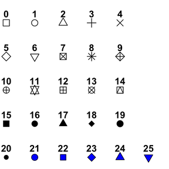

```{r setup, include=FALSE}
knitr::opts_chunk$set(echo = TRUE, eval=FALSE)

library(tidyverse)
library(ds4b.materials)
```

## Setup

To do these exercises, you will need to load two libraries: `tidyverse` (allows you to use `ggplot2` and `forcats` functions) and `ds4b.materials` (contains the `sparrows`) dataset.

Copy and paste this code into Console to begin:

```
library(tidyverse)
library(ds4b.materials)
```

<br>

---

<br>

## Exploring the dataset

All exercises here will use a pre-loaded dataset called `sparrows`. This dataset was collected in 1898 by Hermon Bumpus, an American biologist working at Brown University . Immediately following a bad winter storm, he collected 136 English house sparrows (some alive, some dead), *Passer domesticus*, and brought them indoors. Of these birds, 64 had died during the storm, but 72 recovered and survived. Bumpus measured the birds' physical traits (in mm or g) and recorded them for future generations of data science students.

**Before you begin the exercises, examine the dataset here!! AS A GENERAL RULE, you should ALWAYS ALWAYS ALWAYS look at data before (and while!) plotting!!**

<div class = "prompt">Begin exploring the dataset by simply running `sparrows`, the name of the pre-defined data frame.</div>

+ Each row in the dataset records a single *observation* - in other words, each row corresponds to an individual sparrow. Each column contains a variable. 

```{r sparrows-solution}
# Literally run this code. No mystery!
sparrows
```


<div class = "prompt">Use the functions `nrow()`, `ncol()`, and `names()` to quickly see, respectively, the number of rows in the data frame, the number of columns in the data frame, and the column (variable!) names of the data frame.</div>

```{r nrow-sparrows-solution}
# Run each function with the argument sparrows, and examine the output to see the answers
nrow(sparrows)
ncol(sparrows)
names(sparrows)
```


<div class = "prompt">You can quickly see all the datatypes of the data frame's columns with the function `str()`.</div>

+ You will see the dataset has three categorical variables that R refers to as "factors." Each of these variables has two *levels*, which means "categories in the categorical variable." In this dataset, for example, the variable `Age` has three levels: "Adult", "Juvenile", and "Young". You will see the remaining 9 variables are all numeric continuous. 

```{r str-sparrows-solution}
# Provide the function str() with the argument sparrows
str(sparrows)
```


<div class = "prompt">Use the function `summary()` to get something magical: A quick summary of each variable in the dataset! For factor variables, this command tells you the count of each level. For numeric variables, this command gives you the five-number summary and the mean.</div>


```{r summary-sparrows-solution}
# Provide the function summary() with the argument sparrows
summary(sparrows)
```


<div class = "prompt">Remember, you can examine individual columns with several helpful functions (`summary()` is easily the most comprehensive) using the dollar sign to reference them from the data frame. Run the code below to see this in action, and then adapt the code to look at the variable `Sex` instead of `Wingspread`.</div>

```
summary(sparrows$Wingspread)
```

```{r summary-column-solution}
summary(sparrows$Sex)
```

<br>

-----

<br>


## The `introverse` is here to help

Don't forget to use the `introverse` library to help you! The library has been loaded into these exercises. Here are all the help topics you might want for these exercises:

+ Plot setup:
  + `ggplot()` for setting up the plot. To get help, `get_help("ggplot")` (with quotes!), and so on for the rest below...
  + `aes()` for _mapping_ variables to plot aesthetics
+ Plot geometries:
  + (Set 1,5) `geom_point()` for making points. Here, we only use `geom_point()` to make scatterplots, but this geom can be used to make points more generally also
  + (Set 2) `geom_histogram()`, for making histograms
  + (Set 2) `geom_density()`, for making density plots
  + (Set 2) `geom_boxplot()`, for making boxplots
  + (Set 2) `geom_jitter()`, for making strip/jitter plots
  + (Set 2) `geom_violin()`, for making violin plots
  + (Set 3) `geom_bar()`, for making bar plots that show counts of a categorical variable
  + (Set 5) `geom_smooth()`, for adding trendlines, usually to a scatterplot
+ Additional plot features:
  + (All sets) `labs()`, for adding/customizing labels to the plot
  + (Set 6) [This post](https://spielmanlab.github.io/introverse/articles/color_fill_scales.html) with functions for customizing mapped color/fill palettes. 
    + Use any of these for more help: `get_help("scale_color_manual")`, `get_help("scale_color_brewer")`, or `get_help("scale_color_viridis_d")`
+ Factors:
  + (Set 4) `fct_relevel()` for changing the order of a factor variable
  
You can use the `get_help()` function in _any code chunk_ to get some help, which will open in another browser! Prefer point-and-click? Use [this link](https://spielmanlab.github.io/introverse/articles/introverse_online.html) (but beware, there is a lot going on there...).

<br>

-----

<br>

## Set 1: Scatterplots

Scatterplots show the **relationship** between two variables, and they use the `geom_point()` geometry as shown in this example where sparrow `Weight` is plotted *across* sparrow `Wingspread` (_y goes across x_).

```scatter_demo
ggplot(sparrows) + # Use the sparrows dataset
  aes(x = Wingspread, y = Weight) +  # Specify columns Wingspread and Weight to go on x and y axis. 
  geom_point() # Use points
```

The `geom_point()` geom can accept several visual features, which can either be plainly specified to `geom_point()` or specified as an *aesthetic* if they map to the data. The most important ones are:

+ `color`: Color of points
  + *Certain* types of points can also have a `fill`, and these are introduced in Set 5 (Scatterplots Part 2) of these exercises.
+ `size`: Size of points
+ `shape`: Shape of points
+ For more, run `get_help("geom_point")` in a code chunk here to see the `introverse` docs.

<div class="prompt">Make a scatterplot of femur length (`Femur_Length`) across `Wingspread.`</div>

+ Remember:This terminology means _y across x_. Therefore, `Femur_Length` should be mapped to the y-axis, and `Wingspread` should be mapped to the x-axis. 


```{r scatter_1-solution}
ggplot(sparrows) + 
  aes(x = Wingspread, y = Femur_Length) +  
  geom_point() 
```

<div class = "prompt">Again make a scatterplot of `Femur_Length` across `Wingspread`, but make all points the color red.</div>

+ Hint: This is simply coloring points, not mapping color to a variable. Just add the color argument to `geom_point()`. Colors MUST go in QUOTES - "red" or 'red', NOT red.


```{r scatter_2-solution}
ggplot(sparrows) + 
  aes(x = Wingspread, y = Femur_Length) +  
  geom_point(color = "red") 
```

<div class = "prompt">Again make a scatterplot of `Femur_Length` across `Wingspread`, but this time color all points _based on survival status_.</div>

+ Hint: This IS mapping a variable (specifically, `Survival`!) to a color, so you need to place your color argument _inside aes()_.  Your plot should look like this:

```{r scatter_3-show, include=TRUE, eval=TRUE, echo=FALSE, fig.width = 4, fig.height = 3}
ggplot(sparrows) + 
  aes(x = Wingspread, y = Femur_Length, color = Survival) +  
  geom_point() 
```

```{r scatter_3-solution}
ggplot(sparrows) + 
  aes(x = Wingspread, y = Femur_Length, color = Survival) +  
  geom_point() 
```

<br>

#### **ALERT!** 
An *extremely common* bug/typo you can now look forward to doing for the rest of your life is accidentally placing a column *outside* of `aes()`. Here's an example of that bug - run the code to see how it produces a error by coping/pasting into Console. _There's a bug here!_

```
ggplot(sparrows) + 
  aes(x = Wingspread, y = Femur_Length) +  
  geom_point(color = Survival) 
```

**What's going on above exactly?** `ggplot2` can only automatically know that you are referring to a column if it's inside `aes()`. If it's outside an `aes()`, R wants to find a variable with that name. But, `Survival` is not a variable on its own - it only exists as a column within `sparrows`. _Try to modify and re-run the code so that color is properly mapped to the variable `Survival`._ (Hint: `color = Survival` must be an argument to `aes()`!).

```{r scatter_sidenote-solution}
ggplot(sparrows) + 
  aes(x = Wingspread, y = Femur_Length, color = Survival) +  
  geom_point() 
```


<div class = "prompt">Again make a scatterplot of femur length across wingspread, but this time color all points based on the `Weight` variable. Unlike `Survival`, `Weight` is a *numeric continuous* variable, so you'll get a gradient of colors rather than a single discrete color for each survival category.</div>

+ Your plot should look like this:
  
  ```{r scatter_4-show, include=TRUE, eval=TRUE, echo=FALSE, fig.width = 4, fig.height = 3}
  ggplot(sparrows) + 
    aes(x = Wingspread, y = Femur_Length, color=Weight) +  
    geom_point() 
  ```

```{r scatter_4-solution}
ggplot(sparrows) + 
  aes(x = Wingspread, y = Femur_Length, color = Weight) +  
  geom_point() 
```


<div class = "prompt">Again make a scatterplot of femur length across wingspread, with points colored based on _weight_. But this time, let's add some more professional labels to the plot using the `labs()` function. The code below starts off the question for you by adding a custom label to the X axis. See it in action first before adding more labels!</div>

+ You'll need to more about this function from the `introverse` with this command: `get_help("labs")` (run it below, or see [here](https://spielmanlab.github.io/introverse/introverse_docs/ggplot2_labs.html)). Then, apply what you've learned to add the following labels to your plot:
  + Y axis: "Femur Length (mm)"
  + Title: "Scatterplot of sparrow wingspread and femur length"
  + For some extra bells and whistles, try adding a caption or subtitle!!


```scatter_5
ggplot(sparrows) + 
  aes(x = Wingspread, y = Femur_Length, color = Weight) +  
  geom_point() +
  labs(x = "Wingspread (mm)")
```

```{r scatter_5-solution}
ggplot(sparrows) + 
  aes(x = Wingspread, y = Femur_Length, color = Weight) +  
  geom_point() +
  labs(x = "Wingspread (mm)",
       y = "Femur Length (mm)",
       title = "Scatterplot of sparrow wingspread and femur length")
```

<br>

#### **PAUSE!** for an important lesson

Look at the solution code provided for the previous exercise. Below, I write the exact same code again, but *all on one line* (the text is "wrapped" in the window you see, so it appears on multiple lines but technically it is not!). As you will notice, it is _absolutely awful to try and read_. Even though the code is technically correct, it is *poorly organized*, making it extremely challenging to get any coherent sense of what the code is doing. 

```oneline
ggplot(sparrows) + aes(x = Wingspread, y = Femur_Length, color=Weight) +geom_point() + labs(x = "Wingspread (mm)", y = "Femur Length (mm)", title = "Scatterplot of sparrow wingspread and femur length")
```

When crafting plots with `ggplot2`, it is **strongly recommended (_yes, you will be graded on this_)** to space out your code like the solutions demonstrate. Every time you add the next function, start a new line. Remember to keep the plus sign `+` at the END of a line! If you don't end a line with the `+`, R will think the command is over - it won't know to check if there's a plus sign coming up. You'll also notice in the `labs()` function, I separate arguments one line at a time, again making sure the comma falls at the END of a line and never at the beginning.

In other words...

```morelines
## YES
ggplot(sparrows) + 
  aes(x = Wingspread, y = Femur_Length) +
  geom_point()

## ALSO YES
ggplot(sparrows) + 
  aes(x = Wingspread, 
      y = Femur_Length) +
  geom_point()

## NO - disorganized and hard to read, especially when plots get more complex
ggplot(sparrows) + aes(x = Wingspread, y = Femur_Length) + geom_point()

## NO - this is a BUG in plotting code because you cannot start a line with +
ggplot(sparrows) + 
  aes(x = Wingspread, y = Femur_Length) 
  + geom_point()

```


<br>

---

<br>

## Set 2: Visualizing distributions

There are *many* different plotting strategies for visualizing distributions, specifically, *values of a numeric variable.* Some more popular options and their geoms (which link to the documentation!) include...

Plot | Geom (yes, these are links!) | Notes
:----|:-------|:-------
Histogram    | [`geom_histogram()`](https://spielmanlab.github.io/introverse/introverse_docs/ggplot2_geom_histogram.html) | Only ONE axis is specified in `aes()` (usually the x-axis). `ggplot2` takes care of the other axis for you - it *counts and bins on your behalf!* (A close relative is *frequency polygons*)
Density plot | [`geom_density()`](https://spielmanlab.github.io/introverse/introverse_docs/ggplot2_geom_density.html) | Think of this as a smoothened histogram. Same as for histogram, you only specify the X axis.
Boxplot      | [`geom_boxplot()`](https://spielmanlab.github.io/introverse/introverse_docs/ggplot2_geom_boxplot.html) | Best used when making multiple boxplots in a single panel
Strip Plot   | [`geom_jitter()`](https://spielmanlab.github.io/introverse/introverse_docs/ggplot2_geom_jitter.html)  | Or, `geom_point(position = position_jitter())`!
Violin Plot  | [`geom_violin()`](https://spielmanlab.github.io/introverse/introverse_docs/ggplot2_violin.html) | The hybrid child of a density plot and a boxplot, kind of!


**To learn how to make each type of plot, we will visualize the distribution of `Wingspread`.**

<div class = "prompt">Make a histogram of sparrow wingspread using `geom_histogram()`.</div>

+ Remember: You only should specify the x-axis; `ggplot2` will do the y-axis for you since the y-axis is a *statistical transformation* (count).
+ For an added insight, try specifying `Wingspread` as the `y` *instead of* as the `x` aesthetic. `ggplot2` will then make a horizontal histogram!

```{r dist_1-solution}
ggplot(sparrows) +
  aes(x = Wingspread) +
  geom_histogram()

# This makes a horizontal histogram:
ggplot(sparrows) +
  aes(y = Wingspread) +
  geom_histogram()
```

You will notice that `ggplot2` returns a *message* (not an error!) when you make histograms: 
<br>
`stat_bin()` using `bins = 30`. Pick better value with `binwidth`.
<br>
This is an EXPECTED AND NORMAL message. `ggplot2` is telling you: I assumed a default of *30 bins* along your X-axis in your histogram, but you should change this to something else if you want! 

The message suggests ONE way you can customize the binning: Using the argument `binwidth` with `geom_histogram()` to specify how wide along the X-axis a bin should be. Alternatively, you can use the argument `bins` with `geom_histogram()` to specify how many bins there should be (its default is 30! Get it?).

<div class = "prompt">Re-create your histogram in five separate versions, each with a different specification to `binwidth`: 0.1, 1, 5, 10, and 20.</div>

+ Hint: To complete this question, make the same histogram as before except with the argument `binwidth = 0.1` provided to `geom_histogram()`. Make all the bin widths one at a time!
+ *Think about* which version(s) represent(s) the data well, and which version(s) is/are just terrible ideas. 
+ For an added challenge, also experiment with the `bins` argument instead of `binwidth`.


```{r dist_2-solution}
# binwidth of 0.1
ggplot(sparrows) +
  aes(x = Wingspread) +
  geom_histogram(binwidth = 0.1)

# binwidth of 1
ggplot(sparrows) +
  aes(x = Wingspread) +
  geom_histogram(binwidth = 1)

# binwidth of 5
ggplot(sparrows) +
  aes(x = Wingspread) +
  geom_histogram(binwidth = 5)

# binwidth of 10
ggplot(sparrows) +
  aes(x = Wingspread) +
  geom_histogram(binwidth = 10)

# binwidth of 20
ggplot(sparrows) +
  aes(x = Wingspread) +
  geom_histogram(binwidth = 20)
```
<br>
This is really where using variables start to become important: Let's say you have some R code which creates 50 histograms, and you want 15 bins for all histograms (i.e., `geom_histogram(bins = 15)`). One option is to make all plots and write `15` for the argument. This works well..until you change your mind later and decide that maybe 12 would have been better. Rather than having to find and replace all `15`'s, we could just have a variable used in the code, and simply change the variable and have it automatically apply. 

<div class = "prompt"> Run the code below to practice using variables in this context. You'll notice there are 15 bins in the resulting plot. Then, modify the code to *instead define* `my_bins <- 5` (without touching the actual `ggplot2` code!), and re-run the chunk to see how there are now 5 bins.</div>

```mybins
my_bins <- 15
ggplot(sparrows) +
  aes(x = Wingspread) +
  geom_histogram(bins = my_bins)
```

```{r dist_3-solution}
my_bins <- 5
ggplot(sparrows) +
  aes(x = Wingspread) +
  geom_histogram(bins = my_bins)
```

<div class = "prompt"> How about some colors? Add "just a fill" and "just a color" of your choosing to the plot. This will also help you to see the boundaries of your bins.</div>

+ Remember: For a 2D shape like a bar in a histogram, the **color is outline** and **fill is fill**.
+ Don't forget [all the R colors you can use!!](https://github.com/sjspielman/datascience_for_biologists/raw/master/docs/tutorials/Rcolor.pdf)!
+ After you make your colored and filled histogram, also add "just a size" (use a value below 3, trust me...) to your histogram with the argument `size` to see what this argument does in histograms.
+ **For an added challenge...**
  + Make all your visual features (fill, color, and size) variables to use in your plot rather than the direct values, similar to how you practiced with `my_bins` in the previous question.
  + Make sure to choose _meaningful variable names._ In other words, `my_bins` is a lot more meaningful than `x`! Adopting this "coding best practice" makes your code easier for YOU to read, write, and work with.


```{r dist_4-solution}
ggplot(sparrows) +
  aes(x = Wingspread) +
  geom_histogram(color = "chocolate3", fill = "skyblue")

# Added challenge, with size:
ggplot(sparrows) +
  aes(x = Wingspread) +
  geom_histogram(color = "chocolate3", 
                 fill = "skyblue", 
                 size = 2)

# Adding
hist_color <- "chocolate3"
hist_fill <- "skyblue"
hist_line_size <- 2
ggplot(sparrows) +
  aes(x = Wingspread) +
  geom_histogram(color = hist_color, 
                 fill = hist_fill, 
                 size = hist_line_size)

```

<div class = "prompt"> Now make a *density plot* of `Wingspread` using `geom_density()`.</div>

+ Since the y-axis of density plots are a transformed value, leave the `y` aesthetic blank just like for histograms. 
+ *Start off strong by adding "just a FILL" of your choosing to your density plot!!*


```{r dist_5-solution}
ggplot(sparrows) +
  aes(x = Wingspread) +
  geom_density(fill = "palegreen4")
```

<div class = "prompt">A common visualization feature we often use, especially in density plots, is to make colors *transparent.* To add transparency to colors, we can use the `alpha` argument *given directly to the relevant geom*. Values of alpha range from 0-1, where 0 is fully transparent and 1 is fully opaque. Add an alpha argument (along with a fill argument!) to `geom_density()` to practice this argument. You might have to do some trial/error to find a good alpha value. Welcome to programming!</div>

+ Again, for an added challenge, make a variable to use for your `alpha` value.


```{r dist_6-solution}
ggplot(sparrows) +
  aes(x = Wingspread) +
  geom_density(fill = "palegreen4", alpha = 0.6) # Using 0.6 for example. Other alphas are not necessarily "wrong"!


# With a variable:
density_alpha <- 0.6
ggplot(sparrows) +
  aes(x = Wingspread) +
  geom_density(fill = "palegreen4", alpha = density_alpha)
```

<div class = "prompt"> Let's now look at *both* male and female distributions (variable `Sex`) in one plot. Accomplish this with the same code as before, except add an _aesthetic mapping_ to fill from `Sex`.</div>

+ Compare this plot and the previous plot carefully _in terms of their grammar_ to see why only adding the fill aesthetic accomplished the goal. The x-axis is still `Wingspread`, and the y-axis is still automatically calculated. Therefore, the only distinction between plots is the _fill_.
+ Using `alpha` is a really, really good idea here. If you don't use `alpha`, you can't fully see the distributions. It's such a good idea, that it's _required_. Use trial and error to find a good value between 0-1.
+ You have now made an "overlapping density plot" which should look like this:
```{r dist_7-show, include=TRUE, eval=TRUE, echo=FALSE, fig.width = 4, fig.height = 3}
ggplot(sparrows) +
  aes(x = Wingspread, fill = Sex) +
  geom_density(alpha = 0.6)
```


```{r dist_7-solution}
ggplot(sparrows) +
  aes(x = Wingspread, fill = Sex) +
  geom_density(alpha = 0.6)
```

<div class = "prompt"> Moving on to *boxplots*: Make a boxplot of Wingspread for each Sex with `geom_boxplot()`, in other words, Wingspread _across_ Sex. Axes are not transformed values in boxplots, so you'll need to specify both an x and y variable.</div>

+ Up your game right away! Can you add "just a fill" and/or "just a color"? Your plot, your choice!
+ Your plot should look like this (but maybe with colors/fills of your choosing??) - 
  ```{r dist_8-show, include=TRUE, eval=TRUE, echo=FALSE, fig.width = 4, fig.height = 3}
  ggplot(sparrows) +
    aes(x = Sex, y = Wingspread) +
    geom_boxplot()
  ```


```{r dist_8-solution}
# Boxplot with "just" a fill
ggplot(sparrows) +
  aes(x = Sex, y = Wingspread) +
  geom_boxplot(fill = "slateblue3")
```

<div class = "prompt"> Practice making more boxplots (and learning the principles of `ggplot2`) with the following tasks:</div>

+ Instead of "just" a fill, modify the previous boxplot to fill distributions based on `Sex`. To accomplish this, you'll need to remove the "just a fill" and include a fill mapping in `aes()`. It should look like this:

  ```{r dist_9-show, include=TRUE, eval=TRUE, echo=FALSE, fig.width = 4, fig.height = 3}
  ggplot(sparrows) +
    aes(x = Sex, y = Wingspread, fill = Sex) +
    geom_boxplot()
  ```
+ THEN, make another one!! Instead of filling by `Sex`, fill by `Survival`, but still keep `Sex` along the x-axis.
  + *After you complete this plot*, really look at it carefully to understand how each aesthetic data mapping contributed to the plot. 

_This is how you can make a *grouped boxplot*, and it all starts with applying the grammar of graphics._


```{r dist_9-solution}
# Boxplot filled by Sex - don't forget to remove any straggling "just" fills (see next plot)
ggplot(sparrows) +
  aes(x = Sex, y = Wingspread, fill = Sex) +
  geom_boxplot()

# The "just blue" fill will OVERRIDE aes(fill = Sex) - be careful!!!
ggplot(sparrows) +
  aes(x = Sex, y = Wingspread, fill = Sex) +
  geom_boxplot(fill = "blue")

# Boxplot filled by Survival - make sure you see how the aes mappings lead to the created plot! 
# Confused? Great! That's why you're in a class and not doing this alone! Ask me questions!!!
ggplot(sparrows) +
  aes(x = Sex, y = Wingspread, fill = Survival) +
  geom_boxplot()
```

<div class = "prompt"> Re-make the boxplots above but as a *violin plot* using `geom_violin()`. Your code here will be virtually identical, except for the geom specification. Bravely forge ahead!</div>


```{r dist_10-solution}
# Violin with "just" a fill
ggplot(sparrows) +
  aes(x = Sex, y = Wingspread) +
  geom_violin(fill = "slateblue3")

# Violin filled by Sex 
ggplot(sparrows) +
  aes(x = Sex, y = Wingspread, fill = Sex) +
  geom_violin()

# Violin filled by Survival 
ggplot(sparrows) +
  aes(x = Sex, y = Wingspread, fill = Survival) +
  geom_violin()
```

<div class = "prompt"> Let's now practice strip plots, also known as jitter plots since they "jitter" points along the x-axis. Use `geom_jitter()` to make a strip plot of `Wingspread` across `Sex`.</div>

+ Your plot should roughly look like this (but remember, jittering is random so it won't be identical!)
  ```{r dist_11-show, include=TRUE, eval=TRUE, echo=FALSE, fig.width = 4, fig.height = 3}
  ggplot(sparrows) +
    aes(x = Sex, y = Wingspread) +
    geom_jitter(width = 0.2)
  ```
+ You may need to customize the _spacing_ of the points in the strip plot so that it is _totally unambiguous_ which point belongs to which x-axis category. You can do this with the argument `width` to `geom_jitter()`. I have personally found that 0.1-0.3 is usually a nice range for this argument.
+ You may want to change the size of points to make everything cleanly visible. Perhaps the plot would also benefit from some _transparency_ (`alpha`) to the points?
+ The "jittering" to the points is random, so every time you re-make the plot, the specific x-location of the points will change. 
+ Fun fact: `geom_jitter()` is actually just a special version of `geom_point()`, so all point aesthetics apply here. In fact, `geom_jitter()` is just a shortcut for the more annoying-to-write `geom_point(position = position_jitter())`.


```{r dist_11-solution}
# Strip plot
ggplot(sparrows) +
  aes(x = Sex, y = Wingspread) +
  geom_jitter()

# narrower width - compare this to the default above to understand how it works!
ggplot(sparrows) +
  aes(x = Sex, y = Wingspread) +
  geom_jitter(width = 0.1)

# want to change the size? practice learning how these arguments modify the plot!
# "trial and error" with arguments like width, size, and alpha is how we make plots appealing and clear! 
ggplot(sparrows) +
  aes(x = Sex, y = Wingspread) +
  geom_jitter(width = 0.1, size = 3, alpha = 0.5)
```

<div class = "prompt"> Re-make the strip plot, but also color by `Survival` (inside `aes()`!). You'll find a result similar to the boxplot version of this plot.</div>

+ Think: Why did I say color and not fill, as I did for boxplots and violin plots? You just thought: Ah, it's because here, we have 1-dimensional points, which can only have a color, not fill.
+ Make sure to check the jitter width. Think: Does it need to be tweaked for clear interpretation? You just thought: Definitely, I really need to tweak the width to find the "right" amount.


```{r dist_12-solution}
ggplot(sparrows) +
  aes(x = Sex, y = Wingspread, color = Survival) +
  geom_jitter(width = 0.1)

# Bonus information: this is actually just a shortcut for...
ggplot(sparrows) +
  aes(x = Sex, y = Wingspread, color = Survival) +
  geom_point(position = position_jitter(width = 0.1))
```


<br>

---

<br>

## Set 3: Visualizing Amounts/Counts

The most common approach visualizing amounts, or count, data is with barplots, which we will focus on in this set. We use barplots to show the counts in different categories of a categorical variable and/or a discrete numeric variable: the x-axis will display the categories, and the y-axis will have a bar whose height equals the count.

<div class = "prompt"> Just as `ggplot2` is a real pal and does all the binning/counting for you when you call `geom_histogram()`, `ggplot2` will do all the barplot counting for you as well with the function `geom_bar()`. Use `geom_bar()` to make a barplot of the `Survival` counts.</div> 

+ Hint: Survival belongs on the x-axis, and ggplot takes care of the y-axis for you. You only need an x-axis mapping and the `geom_bar()` geom!


```{r bar_1-solution}
ggplot(sparrows) +
  aes(x = Survival) +
  geom_bar()
```

<div class = "prompt"> Customize your barplot by adding a "just a" color and fill of your choosing. </div>

+ These are NOT mapped aesthetics. Simply provide color and fill arguments to `geom_bar()` using your favorite colors.
+ You may also want to experiment with the `width` argument to `geom_bar()` to find a bar width that suits you (choose a number between 0-1), or a `size` argument to customize the size of bar outlines. 


```{r bar_2-solution}
ggplot(sparrows) + 
  aes(x = Survival) +
  geom_bar(color = "forestgreen", 
           fill = "beige")

# Experiment with size and width! Spielman did some trial and error and personally liked this - 
ggplot(sparrows) + 
  aes(x = Survival) +
  geom_bar(color = "forestgreen", 
           fill = "beige", 
           width = 0.2, 
           size = 0.75)
```

<div class = "prompt"> Again modify this barplot of `Survival`, but make the following changes:</div>


+ Remove the "just a fill" argument, and...
+ Replace it with fill that is an *aesthetic mapping* to `Age`. 
+ You can keep or remove your color per your choice. In the end, you will have made a _grouped barplot_ jointly visualizing counts of Age and Survival.
+ Your plot should look like this:


  ```{r bar_3-show, include=TRUE, eval=TRUE, echo=FALSE,  fig.width = 4, fig.height = 3}
ggplot(sparrows) + 
  aes(x = Survival, fill = Age) +
  geom_bar()
  ```


```{r bar_3-solution}
ggplot(sparrows) + 
  aes(x = Survival, fill = Age) +
  geom_bar()
```
<div class = "prompt"> Re-make the plot again, but this time *switch* `Age` and `Survival` to have `Age` on the x-axis and `Survival` as the color. This plot displays the same data but with a different emphasis.</div>

```{r bar_4-solution}
ggplot(sparrows) + 
  aes(x = Age, fill = Survival) +
  geom_bar()
```

<div class = "prompt"> By default, `ggplot2` makes "stacked" barplots when there are multiple groups. We can also show them "side-by-side", which is called "dodged", by straight-up adding this argument to `geom_bar()`: `position = position_dodge()`.</div>

+ Hint: Literally all you need to do is, instead of writing `geom_bar()`, write it wit this extra argument: `geom_bar(position = position_dodge())`
+ Hint 2: Feeling fancy? Why not add just a color? Just a fill? A mapped color? A mapped fill? Have some fun with it :)
+ Hint 3: This is on HW4!


```{r bar_5-solution}
ggplot(sparrows) + 
  aes(x = Age, fill = Survival) +
  geom_bar(position = position_dodge())
```

<div class = "prompt"> For fun (so fun!), make it a *horizontal* barplot!! Simply change the `x` mapping to `y` instead, and don't provide an `x` aesthetic. As always, drawing it out will help!</div>


```{r bar_7-solution}
# Stacked and horizontal: 
ggplot(sparrows) +
  aes(y = Age, fill = Survival) +
  geom_bar()

# Dodged and horizontal:
ggplot(sparrows) +
  aes(y = Age, fill = Survival) +
  geom_bar(position = position_dodge())
```


<br>

---

<br>

## Set 4: Changing the order of factors

> These exercises will teach you a new skill that you will need for HW4 and more!

The code below makes a scatterplot of femur length across wingspread with points colored by _Age_. Have a look at the code, _run it_, and make sure you are comfortable with the plot/code overall before proceeding. Otherwise, great time to pause and check in with Slack or Dr. Spielman!

```fctdemo1
ggplot(sparrows) + 
  aes(x = Wingspread, 
      y = Femur_Length, 
      color = Age) +  
  geom_point()
```

You'll notice in the legend that the colors are ordered "Young", "Adult", "Juvenile", "Young" - this is because the factor variable is in that order. We can see the ordered categories, aka _levels_, of a factor variable with `levels()`. Run the code below to see the order of levels:

```sparrowslevels
levels(sparrows$Age)
```


What if we wanted the order to be different and show the `Age` variable in this (more reasonable) order: "Juvenile", "Young", and finally "Adult" last? There are several strategies to accomplish this task, and we will learn how to do this using a function from the package [forcats](https://forcats.tidyverse.org/reference/), a `tidyverse` package that helps change the order of a factor variable. The package name involves several puns, and the library has been pre-loaded for you in these exercises. 

We will use the function `fct_relevel()` from the `forcats` package, which you can always learn more about with `get_help("fct_relevel")` (scroll to BOTTOM of this page to see an example with a plot!). Begin to see how this function works below - this demo code changes the `Age` levels to be in order "Juvenile", "Young", "Adult". We provide arguments in this order: First, the variable to work with (the `Age` column), and then just a bunch of strings representing the new order we want. _Make sure to spell these categories precisely as they appear in the dataset!!_ 

+ This code does not redefine the `Age` column since we aren't assigning anything with `<-`. It is simply showing us the output from performing such an operation. The data remains fully unchanged, the order of levels has changed to the order we provided - see the bottom of the output!

```firstfctrelevel
# See how a new order for Levels: is printed at the end??
fct_relevel(sparrows$Age, "Juvenile", "Young", "Adult")
```

<br>
We can actually use this function _directly inside of building a ggplot_!! Remember, when we make ggplots, we do not need to use dollar sign `sparrows$Age` notation - we can simply refer to `Age` since we have already specified using the `sparrows` dataset. **Instead of just mapping color to `Age`, we map color to a releveled-on-the-fly `Age`!**  Run the code below to see how the color legend is re-ordered!

```practicerelevel
ggplot(sparrows) + 
  aes(x = Wingspread, 
      y = Femur_Length, 
      color = fct_relevel(Age, "Juvenile", "Young", "Adult")
    ) + # placing the closing aes() parentheses on this next line to make the above code easier to see.
  geom_point()
```

**We formally changed the order in our plot, hurray!** However, the legend title now looks like hot garbage. We can fix that with a *label* - we need to relabel the *color aesthetic*. Again, run this code to explore in action.

```omgrelevellabelagain
ggplot(sparrows) + 
  aes(x = Wingspread, 
      y = Femur_Length, 
      color = fct_relevel(Age, "Juvenile", "Young", "Adult")
      ) + 
  geom_point() + 
  labs(color = "Sparrow age") # relabel the COLOR legend
```


<div class = "prompt">Using the code above to practice manipulating factor order for plotting, make another version of this scatterplot of femur length across wingspread, but order `Age` as: "Adult", "Young", "Juvenile" instead.</div>


```{r fct0-solution}
ggplot(sparrows) + 
  aes(x = Wingspread, 
      y = Femur_Length, 
      color = fct_relevel(Age, "Adult", "Young", "Juvenile")
     ) + 
  geom_point() + 
  labs(color = "Sparrow age") # relabel the COLOR legend
```


<div class = "prompt">Engage with this new skill by making another scatterplot of femur length across wingspread, but this time, _map color to `Sex` but in order "Female" then "Male" instead of the default_ (see the default for yourself by running `levels(sparrows$Sex)`!!). Make sure you also include a clean legend title!</div>

+ Start slow and build up! I recommend...
+ First, can you make this scatterplot without worrying about the order? 
+ Then, can you modify the `aes()` argument to `color` to change that default order of `Sex`?
+ Finally, can you add in the cleaner legend title?


```{r fct1-solution}
ggplot(sparrows) + 
  aes(x = Wingspread, 
      y = Femur_Length, 
      color= fct_relevel(Sex, "Female", "Male")) +  
  geom_point() + 
  labs(color = "Sparrow sex")
```

<div class = "prompt">Make a _density plot_ of the distribution of femur lengths, where `fill` is mapped to `Sex`, which again should be in order "Female" and then "Male." To ensure a nice legend title, you'll need to use the `fill` argument to labs, not color (since we are mapping a fill!)</div>

+ Again, start slow and build it up! _Run the code in between each step to BUILD IT UP SLOWLY!_
+ First, can you make a density plot of femur lengths?
+ Second, can you map the fill to `Sex`?
+ Third, can you change the Male/Female order?
+ Finally, can you add a nicer legend title?


```{r fct2-solution}
ggplot(sparrows) + 
  aes(x = Femur_Length, 
      fill = fct_relevel(Sex, "Female", "Male")) +  
  geom_density(alpha = 0.5) + 
  labs(fill = "Sparrow sex")
```

<div class = "prompt">Now, make a _boxplot_ of femur length across Sex, where boxplots are filled by `Sex` in the order "Male" then "Female". This one is a little trickier, since we BOTH need to specify `Sex` on the x-axis _and_ as the fill aesthetics. This means we need to use `fct_relevel()` twice. Run and understand this code for some learning to apply to the next question!</div>

+ Start slow and build up, always and forever!
+ Don't forget that you know how to make a boxplot! We need `Femur_Length` on the y-axis and `Sex` on the x-axis, and `Sex` mapped to _fill_.


```{r fct3-solution}
ggplot(sparrows) + 
  aes(x = Sex,
      y = Femur_Length,
      fill = fct_relevel(Sex, "Female", "Male"))+
  geom_boxplot() +
  labs(fill = "Sparrow sex")
```


<div class = "prompt">In the previous boxplot, you'll see because you changed the `fill` order, there is now a _different order_ on the x-axis and in the legend! We want to keep this more consistent, so we need to _also_ provide the whole `fct_relevel()` stuff as the x-axis aesthetic argument, just like we do for fill.</div>

+ When you relevel an axis, the axis label ends up like garbage too! Make sure to clean up the x-axis label by adding an `x` argument to `labs()`!


```{r fct4-solution}
ggplot(sparrows) + 
  aes(x = fct_relevel(Sex, "Female", "Male"), 
      y = Femur_Length,
      fill = fct_relevel(Sex, "Female", "Male"))+
  geom_boxplot() +
  labs(fill = "Sparrow sex",
       x = "Sparrow sex")
```


<br>

---

<br>


## Set 5: Scatterplots, Part 2

Recall that we make scatterplots with `geom_point()`, and scatterplots are used to show the relationship between two x/y numeric values. In this second scatterplot lesson, we'll learn some additional customization strategies for making scatterplots your own.

Let's play with point size and shape. Here are all the different shapes you can use for points when plotting in R, and we literally refer to them as their given number.





<div class = "prompt">The code below creates a scatterplot with points of size 2 that are shaped like triangles, designated by shape `17` (see the shape links above!). First run and understand the template code. Then, modify the code to make the points size 3 and using shape 18 (diamond).</div>

+ Hint: We are literally providing a single size and shape, NOT mapping size and shape to the data! Therefore, they are regular arguments to `geom_point()`, NOT to `aes()`.

```pch17
ggplot(sparrows) + 
  aes(x = Wingspread, y = Femur_Length) +  
  geom_point(size = 2, shape = 17)
```

```{r scatter2_1-solution}
ggplot(sparrows) + 
  aes(x = Wingspread, y = Femur_Length) +  
  geom_point(size = 3, shape = 18)
```

<div class = "prompt"> Shapes 21-25 are actually a little different from other shapes - they can be colored *and filled*. They are therefore like 2D points, so for these point shapes only color means *outline* and fill means *fill*. Re-make the scatterplot but specify shape = 21, and specify a color and fill of your choosing to `geom_point()` to see this in action. Customize the size based on your personal preference!!</div>

+ Don't forget the magical PDF of all the [R colors](https://github.com/sjspielman/datascience_for_biologists/raw/master/docs/tutorials/Rcolor.pdf) ! Have some fun :)


```{r scatter2_2-solution}
ggplot(sparrows) + 
  aes(x = Wingspread, y = Femur_Length) +  
  geom_point(shape = 21, color = "navy", fill ="cadetblue")
```


<div class = "prompt">We can actually *save* plots as variables and re-use them! Because `ggplot2` is designed to keep adding plot components on top of one another, we can even add plot components on top of a plot. See it in action below! </div>

+ Hint: The assignment operator can be used in either direction, as long as it points to the *variable name*. `x <- 7` and `7 -> x` are both good!! `x -> 7` is not :(. Learn more with `get_help("assignment")`.

```practicevariabling
ggplot(sparrows) + 
  aes(x = Wingspread, y = Femur_Length) +  
  geom_point() -> sparrow_wing_femur_plot # Use the assignment operator in the forward direction for better flow of code!

# Examine the plot first
sparrow_wing_femur_plot

# Next, copy this line of code in to see how you can add onto existing plots (anything! not only labs!):
sparrow_wing_femur_plot + labs(x = "OMG WE ADDED AN X-AXIS LABEL!")

# Once you see how that works, add both x and y axis labels to the plot variable
```

```{r scatter2_3-solution}
ggplot(sparrows) + 
  aes(x = Wingspread, y = Femur_Length) +  
  geom_point() -> sparrow_wing_femur_plot

sparrow_wing_femur_plot + 
  labs(x = "Wingspread (mm)", 
       y = "Femur length (mm)")
```


<div class = "prompt">So far, we have been writing separate lines for the `aes()`. In fact, you can include `aes()` in the initial call to `ggplot()` or to any `geom_` function to specify aesthetics for that geom (as we'll learn soon, you can have multiple geoms in a plot!). The code below demonstrates this concept; Run the code below to understand that you can place `aes()` in many locations.</div>


```practiceaesing
# Place aes in ggplot(). This is EQUIVALENT to aes() on its own line
ggplot(sparrows, aes(x = Wingspread, y = Femur_Length)) +  
  geom_point() 

# Place aes in geom_point(). We'll see soon - this does slightly different things!
ggplot(sparrows) +  
  geom_point(aes(x = Wingspread, y = Femur_Length))
```


<div class = "prompt"> Now, let's add another geom! The function `geom_smooth()` can be used to add a trendline to the plot, using one of several modeling options. To get a line of best fit (aka regression line), use the code `geom_smooth(method = "lm")`. Re-create your scatterplot (no colors or aesthetics besides x and y) but add (literally, add with `+`!) this geom to your plot to show the trendline for your data. </div>

+ By default, `geom_smooth()` will include a 95% confidence interval, (statistical bands for the regression line).
+ If you see a squiggly line, you have a bug! This is actually a different type of trendline called a "loess," but we don't want to plot that. We want a _line._ **You must use the argument `method = "lm"` with `geom_smooth()` to get a _linear trendline_, like this: `geom_smooth(method = "lm")`.**
+ You will see that `ggplot2` returns the message: "`geom_smooth()` using formula 'y ~ x'". This is NORMAL and EXPECTED: It is telling you the formula used to calculate the trendline. You can safely ignore it.


```{r scatter2_5-solution}
# With confidence bands
ggplot(sparrows, aes(x = Wingspread, y = Femur_Length)) +
  geom_point() + 
  geom_smooth(method = "lm")
```


<div class = "prompt"> Let's explore the `geom_smooth()` function further by modifying the plot you made for the previous question in the following ways:</div>
 
+ Include the argument `se=FALSE` to `geom_smooth()` to disable the confidence interval bands (`se` stands for "standard error," which is mathematically very closely related to the confidence interval).
+ Explore what adding `color` and `fill` arguments to `geom_smooth()`. Use these arguments in the same way you'd provide "just a color/fill" to `geom_point()` (these are not mapped aesthetics). 
+ One thing you will discover: `fill` doesn't really do much if `se=FALSE`. Understand why this is by trying lots of code!


```{r scatter2_6-solution}

# Without confidence bands
ggplot(sparrows, aes(x = Wingspread, y = Femur_Length)) +
  geom_point() + 
  geom_smooth(method = "lm", se = FALSE)


# With confidence bands and color
ggplot(sparrows, aes(x = Wingspread, y = Femur_Length)) +
  geom_point() + 
  geom_smooth(method = "lm", color = "orange")

# With confidence bands and color and fill!
ggplot(sparrows, aes(x = Wingspread, y = Femur_Length)) +
  geom_point() + 
  geom_smooth(method = "lm", color = "orange", fill = "navy")


# Without confidence bands and color, and a useless fill argument
# If there's no confidence band, it doesn't matter if you specify a fill is - there's nothing to fill!
ggplot(sparrows, aes(x = Wingspread, y = Femur_Length)) +
  geom_point() + 
  geom_smooth(method = "lm", se=FALSE, color = "orange", fill = "navy")

```

<div class = "prompt"> Let's combine insights from the previous questions here: *How does `aes()` placement work when your plot has multiple geoms?* Below are shown several different versions of this code with the _aesthetic color mapping_ placed in different locations in the code. _Run and explore the code in each chunk to see the differences in the output, and THINK ABOUT the differences!_ Try to derive some insights here, and we'll regroup about it as a class.</div>

+ Seriously, insights you gain from these plots are CRITICAL to your understanding of `ggplot2`. Don't take this question lightly! Spend some time, take some of your own notes, and ask me questions!

```aesing1
ggplot(sparrows) +
  aes(x = Wingspread, y = Femur_Length, color = Survival) +
  geom_point() + 
  geom_smooth(method = "lm")

```


```aesing2
ggplot(sparrows) +
  aes(x = Wingspread, y = Femur_Length) +
  geom_point(aes(color = Survival)) + 
  geom_smooth(method = "lm")

```


```aesing3
ggplot(sparrows) +
  aes(x = Wingspread, y = Femur_Length) +
  geom_point() + 
  geom_smooth(method = "lm", aes(color = Survival))
```


<div class = "prompt">Make one more version of this figure that contains the following features:</div>

+ Clean and professional labels using `labs()`
+ *Color* all points based on `Survival`
  + With an included *linear trendline* for EACH `Survival` level (make sure your aesthetic placement is appropriate!)
+ *Size* all points based on `Weight` (Hint: use `size` as an aesthetic to map the given variable)
+ Make all the points into shape 15

Once the plot is made, think about these design choices. Just because one *can* add these visual features, does it mean one *should* add these visual features? (Answer: No.) 
Note: Some of the legend colors will come out funky - later, we will learn how to deal with this type of situation.


```{r scatter2_8-solution}
ggplot(sparrows, aes(x = Wingspread, y = Femur_Length, color = Survival, size = Weight)) +  
  geom_point(shape = 15) + 
  geom_smooth(method = "lm") +
    labs(x = "Wingspread (mm)",
         y = "Femur Length (mm)",
         title = "Scatterplot of sparrow femur length across wingspread ",
         subtitle = "Oh wow is this an ugly plot!")
```


<br>

---

<br>


## Set 6: Customizing mapped color and fill palettes

For this set, you will be practicing applying _non-default_ color and fill palettes to your mapped colors and fills. For all questions, you are simply modifying one of these three plots, and you can copy/paste the "baseline" plot code into all questions in this set!
 
+ **Plot 1: A scatterplot with a _discrete/categorical color mapping_**

  ```{r set5_plot1, fig.width = 5, fig.height = 3, eval=TRUE, echo=TRUE, include=TRUE, class.source = "fold-show"}
  ggplot(sparrows) + 
    aes(x = Wingspread,
        y = Weight,
        color = Age) + # Age is a categorical variable
    geom_point()
  ```

+ **Plot 2:  A violin plot with a _discrete/categorical fill mapping_**

  ```{r set5_plot3, fig.width = 5, fig.height = 3, eval=TRUE, echo=TRUE, include=TRUE, class.source = "fold-show"}
  ggplot(sparrows) + 
    aes(x = Age,
        y = Wingspread,
        fill = Age) + # Age is a categorical variable
    geom_violin() 
   ```   
  

+ **Plot 3: A scatterplot with a _continuous color mapping_**

  ```{r set5_plot2, fig.width = 5, fig.height = 3, eval=TRUE, echo=TRUE, include=TRUE, class.source = "fold-show"}
  ggplot(sparrows) + 
    aes(x = Wingspread,
        y = Weight,
        color = Wingspread) + # Wingspread is a continuous variable
    geom_point()
  ```

<br><br>

### Set 6.1: Specifying custom colors and fills

> Remember to use the PDF with all the colors!! So many colors!!
> Need help? Use `get_help("scale_color_manual")`.

<div class = "prompt">Use the function `scale_color_manual()` to set **THREE** custom colors of your choosing to recreate Plot 1. The code below shows how to use this function: We use the argument `values` to provide _an array_ of your three chosen (string!) colors. (Remember, Plot 1 code is up there!)
<br>
Explore this code, and modify it to provide three DIFFERENT colors of your choosing!</div>

```color1
ggplot(sparrows) + 
  aes(x = Wingspread,
      y = Weight,
      color = Age) + 
  geom_point() + 
  scale_color_manual(values = c("orchid4", "aquamarine3", "brown3"))
```

```{r color1-solution}
ggplot(sparrows) + 
  aes(x = Wingspread,
      y = Weight,
      color = Age) + 
  geom_point() + 
  # different colors are in the values argument:
  scale_color_manual(values = c("hotpink", "chartreuse", "beige"))
```


<div class = "prompt">The three colors you supplied will be used _in order of the factor variable_ `Age`, which we can check with `levels()`:</div>

```{r checklevels, exercise = TRUE}
levels(sparrows$Age)
```

<div class = "prompt">Bearing in mind the default order of the factors, again use the function `scale_color_manual()` to set colors as...</div>

+ "Adult" should be "purple"
+ "Juvenile" should be "red"
+ "Young" should be "blue"


```{r color2-solution}
ggplot(sparrows) + 
  aes(x = Wingspread,
      y = Weight,
      color = Age) + 
  geom_point() + 
  scale_color_manual(values = c("blue", "purple", "red"))
```


<div class = "prompt">Remake _Plot 2_ (remember you can copy the Plot 2 code down here to start!) with custom _fills_. Since we are now working with _fill aesthetic_, you need to use the function `scale_fill_manual()`. Choose your favorite three colors to use for the FILLS!!</div>


```{r color3-solution}
ggplot(sparrows) + 
  aes(x = Age,
      y = Wingspread,
      fill = Age) + 
  geom_violin() + 
  scale_fill_manual(values = c("orchid4", "aquamarine3", "brown3"))
```

<br><br>

### Set 6.2: Specifying `brewer` colors and fills

Rather than specifying custom colors or fills, we can use one of several _pre-existing palettes_. `ggplot2` comes with two popular palette frameworks: **brewer** scales and **viridis scales**. See what they look like [here](https://spielmanlab.github.io/introverse/articles/color_fill_scales.html#the-colorbrewer-and-viridis-palettes-1). For this section, you'll practice making some plots with the **brewer** scales.

> Big note: Nobody expects you to memorize how to use all these scale color/fill functions!! Instead, you have the resources for figuring out which function you need for the plot you want to make and then how to use that function. It's all about engaging with resources for help - this is true for programmers at ANY level!


<div class = "prompt">Remake _Plot 1_ using the **Dark2** `brewer` palette to color points by `Age`. You should use the function `scale_color_brewer()` for this, and provide the argument `palette = "Dark2"`.</div>


```{r brewer1-solution}
ggplot(sparrows) + 
  aes(x = Wingspread,
      y = Weight,
      color = Age) + 
  geom_point() + 
  scale_color_brewer(palette = "Dark2")
```


<div class = "prompt">Remake _Plot 1_ again using the `brewer` palette to color points by `Age`, but this time choose your own favorite `brewer` palette instead of "Dark2"!</div>


```{r brewer2-solution}
ggplot(sparrows) + 
  aes(x = Wingspread,
      y = Weight,
      color = Age) + 
  geom_point() + 
  scale_color_brewer(palette = "Pastel1")
```


<div class = "prompt">Remake _Plot 2_ twice, using TWO different palettes: `Set1` and `Reds` to get some practice. Since this plot uses a _fill aesthetic_, you will need to use the function `scale_fill_brewer()`.</div>


```{r brewer3-solution}

# Make with Set1 palette
ggplot(sparrows) + 
  aes(x = Age,
      y = Wingspread,
      fill = Age) + 
  geom_violin() +
  scale_fill_brewer(palette = "Set1")


# Make with Reds palette
ggplot(sparrows) + 
  aes(x = Age,
      y = Wingspread,
      fill = Age) + 
  geom_violin() +
  scale_fill_brewer(palette = "Reds")
```


<div class = "prompt">Now, let's remake _Plot 3_, which contains a _continuous color mapping_, resulting in a gradient of point colors. The function to use for a _continuous color brewer scale_ is `scale_color_distiller()`, and we still supply it with the `palette` argument but we can only use one of the gradient color palettes (anything NOT Set3 - Accent). Remake Plot 3 using the red/purple called called `"RdPu"`.</div>


```{r brewer4-solution}
ggplot(sparrows) + 
  aes(x = Wingspread,
      y = Weight,
      color = Wingspread) + 
  geom_point() +
  scale_color_distiller(palette = "RdPu")
```


<div class = "prompt">We can also reverse palettes by adding the argument `direction = 1` to the scale function. Remake the same _Plot3_ with `"RdPu"`, but also include this argument to see the palette flipped.</div>


```{r brewer5-solution}
ggplot(sparrows) + 
  aes(x = Wingspread,
      y = Weight,
      color = Wingspread) + 
  geom_point() +
  scale_color_distiller(palette = "RdPu", direction = 1)
```

<br><br>

### Set 6.3: Specifying `viridis` colors and fills

For this section, you'll practice making some plots with the **viridis** scales.

> Again, Nobody expects you to memorize how to use all these scale color/fill functions!! Instead, we use the resources when we need them!


<div class = "prompt">Remake _Plot 1_ using the default `viridis` palette to color points by `Age`. You should use the function `scale_color_viridis_d()` for this, since `Age` is **discrete**. Since we're using the default scale, no further arguments are needed.</div>


```{r viridis1-solution}
ggplot(sparrows) + 
  aes(x = Wingspread,
      y = Weight,
      color = Age) + 
  geom_point() + 
  scale_color_viridis_d()
```


<div class = "prompt">Remake _Plot 1_ again using the `viridis` palette "magma". Again, we are mapping to `Age` so we should use `scale_color_viridis_d()`, but with the argument `option = "magma"` (not `palette`, but `option`!)</div>


```{r viridis2-solution}
ggplot(sparrows) + 
  aes(x = Wingspread,
      y = Weight,
      color = Age) + 
  geom_point() + 
  scale_color_viridis_d(option = "magma")
```


<div class = "prompt">Remake _Plot 2_ twice, using TWO different palettes: `plasma` and `mako` to get some practice. Since this plot uses a _fill aesthetic_, you will need to use the function `scale_fill_viridis_d()` (still `_d` since still `Age`, still discrete!).</div>


```{r viridis3-solution}

# Make with plasma palette
ggplot(sparrows) + 
  aes(x = Age,
      y = Wingspread,
      fill = Age) + 
  geom_violin() +
  scale_fill_viridis_d(option = "plasma")


# Make with mako palette
ggplot(sparrows) + 
  aes(x = Age,
      y = Wingspread,
      fill = Age) + 
  geom_violin() +
  scale_fill_viridis_d(option = "mako")
```


<div class = "prompt">Now, let's remake _Plot 3_, which contains a _continuous color mapping_, resulting in a gradient of point colors. The function to use for a _continuous color viridis scale_ is `scale_color_viridis_c()` where `_c` is for _continuous_. For this question, simply add on this function without any arguments to use the default `viridis` palette.</div>


```{r viridis4-solution}
ggplot(sparrows) + 
  aes(x = Wingspread,
      y = Weight,
      color = Wingspread) + 
  geom_point() +
  scale_color_viridis_c()
```


<div class = "prompt">Now, again remake _Plot 3_ with the "inferno" palette, by including the `option` argument.</div>


```{r viridis5-solution}
ggplot(sparrows) + 
  aes(x = Wingspread,
      y = Weight,
      color = Wingspread) + 
  geom_point() +
  scale_color_viridis_c(option = "inferno")
```


<div class = "prompt">We can also reverse palettes by adding the argument `direction = -1` (different from `brewer`! Booo!! Hence, always use resources cause this is tricky to memorize! Don't try to memorize!). Remake the same previous plot with "inferno" but also include this argument to see the palette flipped. .</div>


```{r viridis6-solution}
ggplot(sparrows) + 
  aes(x = Wingspread,
      y = Weight,
      color = Wingspread) + 
  geom_point() +
  scale_color_viridis_c(option = "inferno", direction = -1)
```