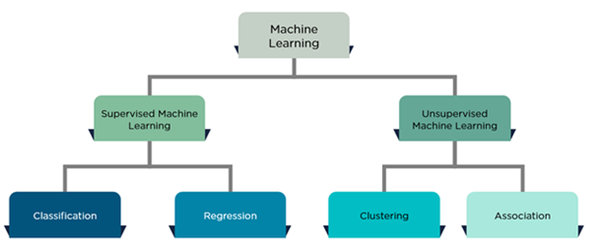

```{css, echo=F}

@media print {
  .has-continuation {
    display: block !important;
  }
}


pre {
  white-space: pre-wrap;
  
}

ul:first-child, ol:first-child {
    margin: 0;
}


.remark-code, .remark-inline-code { 
    color: #326369;
    font-weight: 600;
}
/* Code block code */
.hljs .remark-code-line { 
  font-weight: normal;
  font-size: 15px;
}

.pull-left2{
  float: left;
  width: 85%;
}

.pull-right2{
  float: right;
  width: 30%;
}
```

```{r setup, include=FALSE}
knitr::opts_chunk$set(echo = TRUE, collapse=TRUE)
library(tidyverse)
library(broom)
library(xaringan)
theme_set(theme_bw())
```


## Linear regression vs. logistic regression

+ Linear regression: How much do these (linearly-related) predictors explain variation in my *numeric* response variable?
  

+ Logistic regression: How well do these predictors explain variation in my *categorical __binary__* response variable?
  + E.g. predicting Species in the iris dataset would be a categorical predictor, but NOT binary
  + Type of classifier

---


## Where are we in the "machine learning" universe?


+ Machine learning = the computer learns through experience
 + More data = more experience! *Training models on data IS machine learning*
 + Ignore the AI hype.


```{r out.width = '550px', echo=F}
 
```

.pull-left[
```{r out.width = '250px', echo=F}
knitr::include_graphics("img_logistic/classif_regre.png")
```
]

.pull-right[
```{r out.width = '200px', echo=F}
knitr::include_graphics("img_logistic/clustering_vomit.png")
```
]

---
## Logistic regression
  
  
```{r out.width = '400px', echo=F}
knitr::include_graphics("img_logistic/logit_transform_fromlinear.png")
```

+ Linear regression: $Y =  \beta_0 + \beta_1X_1 + \beta_2X_2 + \beta_3X_3 ... + \beta_NX_N + \epsilon$

--

+ Logistic regression *transforms the predictors* 
  + $t =  \beta_0 + \beta_1X_1 + \beta_2X_2 + \beta_3X_3 ... + \beta_NX_N + \epsilon$
  + $Y = \frac{1}{1 + e^{-t}}$ (or, $p = ...$ in image)

---

```{r}
biopsy <- read_csv("biopsy.csv")
          #paste0("https://raw.githubusercontent.com/sjspielman/",
          #       "datascience_for_biologists/master/docs/fall2020/",
          #       "slides/biopsy.csv"))

dplyr::glimpse(biopsy)
```

---

## Building the logistic regression: Prepare the data

**`glm(response ~ predictors, data = data, family = "binomial")`**

```{r}
## Ensure the column is a factor, OR it has 0/1 values
## Help yourself by coding success = 1, failure = 0. This way you don't need alphabetical order

biopsy %>%
  mutate(outcome_01 = case_when(outcome == "malignant" ~ 1,  ## "success" in model
                                outcome == "benign" ~ 0)) %>%
  select(-outcome) -> biopsy_outcome01

biopsy_outcome01
```

---
## Building the logistic regression: Build the model

**`glm(response ~ predictors, data = data, family = "binomial")`**

```{r}
head(biopsy_outcome01)
# remember: we do NOT want the original outcome as a predictor!!
baseline_logit_fit <- glm(outcome_01 ~ ., data = biopsy_outcome01, family = "binomial")
fit                <- step(baseline_logit_fit, trace = F) # Read "Introduction to Model Selection"!!
```

---

## Interpreting the logistic regression coefficients... don't.

```{r}
broom::tidy(fit)
```

+ For every unit increase in the predictor, the **log odds of success** of the response increases by the coefficient
 + $Pr(success)$ = probability of *malignant* biopsy for a given set of observations (predictors)
 + $Pr(failure)$ = probability of *benign* biopsy for a given set of observations 
 + **Log odds = $ln\bigg(\frac{Pr(success)}{Pr(failure)}\bigg)$**


---

## Visualizing the logistic regression

```{r out.width = '400px', echo=F}
knitr::include_graphics("img_logistic/logit_transform_fromlinear.png")
```

```{r}
## USING head() to make it fit on slides!!

## What would have been your Y-values if this were regression
## YOUR X-AXIS !!
head(fit$linear.predictors) #<<

## The logit transformed - PROBABILITIES OF SUCCESS
## YOUR Y-AXIS !!
head(fit$fitted.values) #<<
```

--

+ $t =  \beta_0 + \beta_1X_1 + \beta_2X_2 + \beta_3X_3 ... + \beta_NX_N + \epsilon$
+ $Y = \frac{1}{1 + e^{-t}}$ 

```{r}
1/(1 + exp(-1 * fit$linear.predictors)) %>% head()
```

---


## Visualizing the model: Prepare the data

```{r, fig.width = 6, fig.height = 4}
tibble(x = fit$linear.predictors, 
       y = fit$fitted.values, 
       # Helps to use the ORIGINAL biopsy version so that outcome is "malignant"/"benign"
       outcome = biopsy$outcome) -> fit_tibble

fit_tibble
```

---

## Visualizing the model

.left[
```{r, fig.width = 6, fig.height = 4}
head(fit_tibble)
```
]

.right[
```{r, fig.width = 6, fig.height = 4}
ggplot(fit_tibble, aes(x = x, y = y)) + 
 geom_line() +
 theme(legend.position = "bottom")
```
]
---

## Visualizing the model FULLY!!!
.left[
```{r, fig.width = 6, fig.height = 4}
head(fit_tibble)
```
]

.right[
```{r, fig.width = 6, fig.height = 4}
ggplot(fit_tibble, aes(x = x, y = y, color = outcome)) +  #<<
 geom_line() +
 theme(legend.position = "bottom")
```
]

---

## Confusion matrix time

```{r out.width = '350px', echo=F}
knitr::include_graphics("img_logistic/confusionmatrix.jpeg") 
```

+ First ask: is the result positive or negative?
+ Then ask: should we have gotten that result though? If yes, *TRUE*. If not, *FALSE*.

--

+ A new arthritis drug does help pain clinical trials, even though it actually does reduce arthritis pain.

--

+ A person with HIV receives a positive test result for HIV.

--

+ A person using illegal performing enhancing drugs passes a test clearing them of drug use.

--

+ A study found a significant relationship between neck strain and jogging, when reality there is no relationship.

--

+ A healthy individual gets a positive cancer biopsy result.


---


## Classification metrics (an abbreviated set)

.pull-right2[
```{r out.width = '200px', echo=F}
knitr::include_graphics("img_logistic/confusionmatrix.jpeg") 
```
]

+ True positive rate: $TPR = TP/P = \frac{TP}{TP + FN}$
  + AKA *sensitivity* AKA *recall*

--


+ True negative rate: $TNR = TN/N = \frac{TN}{FP + TN}$
  + AKA *specificity*

--


+ False positive rate: $FPR = FP/N = \frac{FP}{FP + TN}$
  + AKA *1 - specificity*

--


+ Precision: $PPV = \frac{TP}{TP + FP}$
  + AKA *positive predictive value*

--


+ Accuracy: $\frac{TP + TN}{TP + TN + FP + FN}$

---

## Caculating performance measures

+ Requires a *threshold* to call malignant/benign outcomes. 
+ For an example, let's say >=0.75 is malignant (success). <0.75 is benign (failure)
+ Accuracy: $\frac{TP + TN}{TP + TN + FP + FN}$

```{r}
# Reminder:
tibble(x = fit$linear.predictors, 
       y = fit$fitted.values, 
       outcome = biopsy$outcome) -> fit_tibble

fit_tibble
```


---
$Accuracy = \frac{TP + TN}{TP + TN + FP + FN}$

```{r}
threshold <- 0.75
fit_tibble %>% 
  rename(truth = outcome) %>% #<< 
  mutate(pred = if_else(y >= threshold, "P", "N")) 
```


---
$Accuracy = \frac{TP + TN}{TP + TN + FP + FN}$

```{r}
threshold <- 0.75
fit_tibble %>% 
  rename(truth = outcome) %>% 
  mutate(pred = if_else(y >= threshold, "P", "N")) #<< 
```

---
$Accuracy = \frac{TP + TN}{TP + TN + FP + FN}$

```{r}
threshold <- 0.75
fit_tibble %>% 
  rename(truth = outcome) %>% 
  mutate(pred = if_else(y >= threshold, "P", "N")) %>%
  mutate(classif = case_when(truth == "malignant" & pred == "P" ~ "TP", 
                             truth == "malignant" & pred == "N" ~ "FN",
                             truth == "benign"    & pred == "N" ~ "TN",
                             truth == "benign"    & pred == "P" ~ "FP")) -> model_classif

model_classif
```

---
```{r}
model_classif %>%
  # how many in each classif category?
  count(classif) 
```

+ Accuracy = (437 + 219) / (20 + 7 + 437 + 219) = **0.96**


--
```{r}
model_classif %>%
  count(classif) %>%
  pivot_wider(names_from = classif, values_from = n) #<<
```

--

```{r}
model_classif %>%
  count(classif) %>%
  pivot_wider(names_from = classif, values_from = n) %>%
  mutate(accuracy = (TP + TN)/(TP + TN + FP + FN))
```

---

## How good is the model?

+ In linear regression, we often uses $R^2$ values to compare different viable models. Higher $R^2$ often (but not always!) means, "more predictive model"

--

+ In *logistic regression*, we use confusion matrix calculations and **AUC** (area under the curve... what curve?)

.pull-left2[
+ $TPR = TP/P = \frac{TP}{TP + FN}$
  + AKA *sensitivity* AKA *recall*
+ $TNR = TN/N = \frac{TN}{FP + TN}$
  + AKA *specificity*
+ $FPR = FP/N = \frac{FP}{FP + TN}$
  + AKA *1 - specificity*
+ Precision: $PPV = \frac{TP}{TP + FP}$
  + AKA *positive predictive value*
+ Accuracy: $\frac{TP + TN}{TP + TN + FP + FN}$
]