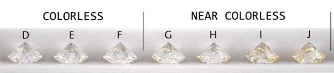

---
output:
  xaringan::moon_reader:
    lib_dir: libs
    css: [default, my_chocolate.css, chocolate-fonts]
    nature:
      highlightStyle:  github
      highlightLines: true
      countIncrementalSlides: false
    seal: false
editor_options: 
  chunk_output_type: console
---


```{css, include=FALSE, echo=FALSE}
.title-slide .bg-text{
  position: absolute;
  top: 45%;
  left: 10%;
  text-align: left;
  color: #000;
}

.huge .remark-code { /*Change made here*/
  font-size: 200% !important;
}
.teenytiny .remark-inline-code { /*Change made here*/
  font-size: 10% !important;
}


```


```{r setup, include=FALSE}
options(htmltools.dir.version = FALSE)
knitr::opts_chunk$set(fig.width=6, fig.height=4)
library(xaringan)
library(tidyverse) 
library(cowplot)
library(patchwork)
library(colorblindr)
theme_set(theme_cowplot())
img_path <- "img/dplyr/"

set.seed(11)
diamonds %>% 
  dplyr::select(carat, cut, color, price, x) %>% 
  sample_n(20) -> diamonds
```

class: title-slide
background-image: url(slide_background_images/hammybeans.png)
background-size: contain

.bg-text[
<br><br><br>
# Introduction to `dplyr`
## Data Science for Biologists

<hr />
**Spring 2021, Dr. Spielman**
]


---
--- 


.pull-left[
```{r out.width = '250px', echo=F}
knitr::include_graphics(file.path(img_path, "dplyr_hex_old.jpg"))
```
]
.pull-right[
```{r out.width = '250px', echo=F}
knitr::include_graphics(file.path(img_path, "dplyr_hex_new.png"))
```
]

---
class: top, center

# The great and powerful **pipe**

```{r out.width = '375px', echo=F}
knitr::include_graphics(file.path(img_path, "MagrittePipe.jpg"))
```

--

```{r out.width = '200px', echo=F}
knitr::include_graphics(file.path(img_path, "pipe.png"))
```

---

# Examples of piping, and formatting goals

```{r}
## Tired
log(5)
```
<br><br>
--

```{r}
## Wired
5 %>% log()
```
<br><br>

--

```{r}
## Inspired
5 %>%
  log()
```

---


# Loading libraries

## You must load your libraries for each R session OR NONE OF THIS WORKS!!

```{r}
library(tidyverse) # convenient for "everything"
#or
library(dplyr) # if you just want to load dplyr (less common)
```


---

.pull-left[
```{r}
print(diamonds)
```
]

.pull-right[
`price`: Price in US dollars

`carat`: Weight of the diamond

`cut`: Quality of the diamond

`color`

`x`: width of diamond in mm


```{r out.width = '400px', echo=F}

```
]

---

# Your first `dplyr` function: `glimpse()`


```{r}
str(diamonds)
```

--
<br><br>

```{r}
glimpse(diamonds) #<<
```

---

# Fully look at the data

```{r}
glimpse(diamonds)
```
<br><br>
```{r}
summary(diamonds)
```


---

# Common tasks we perform on datasets 

+ Subsetting rows. 
    + Ex: Work with Premium diamonds.
    + Ex: Work with only diamonds above a certain carat.
+ Removing duplicate rows
<br><br>
+ Creating new columns
+ Rearranging, removing, or keeping only certain columns
+ Renaming columns
<br><br>
+ Arrange the data based on a column
    + Ex: Arrange in order of price
<br><br>
+ Summarizing data
    + Ex: Calculating the mean price
    + Ex: Calculating the mean price for *each* diamond quality category
---

# Functions ("verbs") for wrangling datasets

+ Subsetting rows. **`filter()`**
    + Ex: Work with Premium diamonds.
    + Ex: Work with only diamonds above a certain carat.
+ Removing duplicate rows **`distinct()`**
<br><br>
+ Creating new columns **`mutate()`**
+ Rearranging, removing, or keeping only certain columns **`select()`**
+ Renaming columns **`rename()`**
<br><br>
+ Arrange the data based on a column **`arrange()`**
    + Ex: Arrange in order of price
<br><br>
+ Summarizing data **`summarize()`**
    + Ex: Calculating the mean price
    + Ex: Calculating the mean price for *each* diamond quality category

---

# Data frame in, data frame out.

**The _first argument_ for most `dplyr` verbs (functions) is a data frame (tibble).**

**Those verbs all _return_ a data frame (tibble).** 


### THIS IS REALLY IMPORTANT!


---

# Diving in with `filter()`


```{r}
# Reminder of the dataset:
diamonds
```

---

# Diving in with `filter()`

### Goal: Subset the data to only Premium quality diamonds


+ First argument: a data frame
+ Additional argument(s): **logical statements** (code that gives `TRUE` OR `FALSE`) about which rows you want to keep
+ *We can directly refer to columns within `dplyr` code*


```{r}
# Keep only Premium quality diamonds:
filter(diamonds, cut == "Premium")
```

---

# Using pipe is the preferred style

```{r}
# Not preferred:
# filter(diamonds, cut == "Premium")

# Also not preferred:
# diamonds %>% filter(cut == "Premium")

# THIS!!!!
# STARS STARS STARS! THIS WAY!
diamonds %>%   #<<
  filter(cut == "Premium")   #<<
```
---

# Cautionary tales

```{r}
head(diamonds)
```

```{r, error=TRUE}
diamonds %>%
  filter(cut == "premium")
```

---


# Cautionary tales

```{r}
head(diamonds)
```


```{r, error=TRUE}
diamonds %>%
  filter(cut == "Premuim")
```

---

# Cautionary tales

```{r}
head(diamonds)
```


```{r, error=TRUE}
diamonds %>%
  filter(quality == "Premium")
```

---


# Cautionary tales

```{r}
head(diamonds)
```


```{r, error=TRUE}
diamonds %>%
  filter(CUT == "Premium")
```

---

# Cautionary tales

```{r}
head(diamonds)
```


```{r, error=TRUE}
diamonds %>%
  filter(cut = "Premium")
```

---

# Cautionary tales

```{r}
head(diamonds)
```


```{r, error=TRUE}
diamonds 
  %>% filter(cut == "Premium")
```

---

# We can have multiple conditions in `filter()`

+ Using a comma in filter acts as "and" (`&`). 
+ Keep all rows where ALL conditions are `TRUE`

```{r}
diamonds %>%
  filter(cut == "Premium", color == "I") #<<
```

---

# We can have multiple conditions in `filter()`


```{r}
diamonds %>%
  filter(cut == "Premium", color == "I", carat > 1)
```

---


# Separate onto new lines when code gets too long

```{r}
diamonds %>%
  filter(cut == "Premium",  #<<
         color == "I",     #<<
         carat > 1)      #<<
```

**Caution!!** Make sure the commas are always on at the _end of a line_

---

# Goal: Subset to only "Ideal and "Premium" diamonds

```{r}
diamonds %>%
  filter(cut == "Ideal", 
         cut == "Premium")
```

--

**That code DID WORK.** It retained all rows whose `cut` equaled "Ideal" **AND** "Premium"! ....But there are no such rows!!


**To reiterate: The code worked perfectly fine, but it didn't do what you might have expected. This is a type of a bug.**


---

## Recall the `%in%` operator

```{r}
colors <- c("red", "orange", "yellow")
"red" %in% colors
"blue" %in% colors
```

---

# Get rows with _either_ cut using `%in%`, NOT `==`

```{r}
diamonds %>%
  filter(cut %in% c("Ideal", "Premium")) #<<
```

---
# Helpful tips


```{r, eval=FALSE}
# Avoid hardcoding by defining this separately
cuts <- c("Ideal", "Premium") #<<
diamonds %>%
  filter(cut %in% cuts) 
```


**Below might seem like it works, but it DOES NOT!**

```{r}
diamonds %>%
  # Why is this NO NO NO NO NO NO NO????
  filter(cut == c("Ideal", "Premium")) #<<
```

---

# Have as many options as you want:

```{r}
diamonds %>%
  filter(cut %in% c("Ideal", "Premium", "Good"))
```

---

# One reason filtering is important:

```{r}
ggplot(diamonds, aes(x = carat, 
                     y = price)) + 
  geom_point(size = 3)
```

--

But what if I *only* want to plot diamonds that cost less than $1000?

---

# Plotting filtered data 

```{r}
diamonds %>%
  filter(price < 1000) -> diamonds_cheaper

ggplot(diamonds_cheaper, aes(x = carat, y = price)) + 
  geom_point(size = 3)
```

---

# Plotting filtered data 

```{r, eval=FALSE}
diamonds %>%
  filter(price < 1000) -> diamonds_cheaper

ggplot(diamonds_cheaper, aes(x = carat, y = price)) + 
  geom_point(size = 3)
```

.pull-left[
```{r, fig.height = 2, fig.width = 3}
diamonds %>%
  filter(price < 1000) %>%  #<<
  ggplot(aes(x = carat, y = price)) +  #<<
    geom_point(size = 3)
```
]
.pull-right[
**Caution:** Be careful to use `%>%` and `+` in the right place. Using the wrong one in the wrong place is a **common bug**!
]
---


# Working with columns with `select()`

.pull-left[
```{r}
diamonds %>%
  select(price, cut)
```
]
--
.pull-right[
```{r}
diamonds %>%
  select(-price, -cut)
```
]
---

# There is a lot of magic in `select()`

```{r}
head(diamonds)

diamonds %>%
  select(price, everything())
```

---


# Creating new columns with `mutate()`

```{r}
diamonds %>%
  mutate(the_number_5 = 5)
```

---


# Creating new columns with `mutate()`

Again, we can directly reference existing columns: 

```{r}
# 'x' is measured in mm
diamonds %>%
  mutate(x_in_cm = x/10)
```

**New column names should always begin with a LETTER and only contain letters, numbers, and underscores.**

---

# What if I want my new variable to be first?

```{r}
# 'x' is measured in mm
diamonds %>%
  mutate(x_in_cm = x/10) %>%
  select(x_in_cm, everything())
```

---


# Also bring `x` forward for easy comparison

> This is part of checking that your `mutate()` command worked. Use your eyes to confirm that `x_in_cm` really is 10*x

```{r}
# 'x' is measured in mm
diamonds %>%
  mutate(x_in_cm = x/10) %>%
  select(x_in_cm, x, everything())
```

---
# This the magic of the pipe

```{r}
diamonds %>%
  filter(carat < 0.5) %>%
  select(carat, price)
```

---

# ONE LINE AT A TIME

## IF YOU DO NOT GO ONE LINE AT A TIME, YOU WILL DO VERY VERY POORLY.

## I REALLY CANNOT EMPHASIZE THIS ENOUGH. 

## ONE. LINE. AT. A TIME.

---

# Make sure this works FIRST


```{r}
diamonds %>%
  filter(carat < 0.5)
```

---

# Then, add the next line

```{r}
diamonds %>%
  filter(carat < 0.5) %>%
  select(carat, price)
```

---

# An smallish example of real-word piping

> This code should not make sense to you, don't worry!

<br><br>

```{r, eval=FALSE}
models %>%
  separate(name, into=c("id", "dataset", "trash"), sep = "\\.") %>%
  replace_na(list(dataset = "PANDIT"))  %>%
  select(-trash) %>%
  group_by(id, datatype) %>%
  mutate(num = 1:n()) %>% 
  ungroup() %>%
  pivot_longer(AIC:BIC, 
               names_to = "ic_type", 
               values_to = "best_model") %>%
  mutate(best_matrix = str_replace(best_model, "\\+.+", "")) -> processed_models
```

---

# So far...

+ `glimpse()` for data frame overviews
+ `filter()` for subsetting rows (observations)
+ `select()` for keeping/removing columns
+ `mutate()` for creating columns


+ Other `dplyr` functions you will see in exercises this week (and will be on the homework)
  + `arrange()`
  + `rename()`
  + `distinct()`
  + `tally()` (we will learn more about this function next week, too)
  
---

# Arranging rows by a variable

```{r}
diamonds %>%
  arrange(carat) #<<
```

---

# For _descending_ order:

```{r}
diamonds %>%
  arrange(desc(carat)) #<<
```

---


# Renaming columns


```{r}
# rename(newname = oldname) !!!
diamonds %>%
  rename(width = x) #<<
```

---


# Removing duplicate rows


```{r}
# boring, since all rows are unique!
diamonds %>%
  distinct() #<<
```

---

# Removing duplicate rows


.pull-left[
```{r}
diamonds %>%
  select(color) 
```
]

.pull-right[
```{r}
diamonds %>%
  select(color) %>%
  distinct()
```
]

---

# Counting the number of rows with code


```{r}
# Returns a number
nrow(diamonds)
```


```{r}
# Returns a number
diamonds %>%
  nrow()
```


```{r}
# Returns a TIBBLE
diamonds %>%
  tally() #<<
```

---