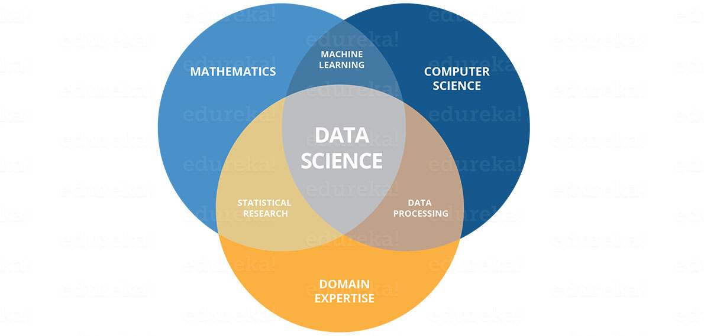

---
output:
  xaringan::moon_reader:
    lib_dir: libs
    css: [default, my_chocolate.css, chocolate-fonts]
    nature:
      highlightStyle:  rainbow
      highlightLines: true
      countIncrementalSlides: false
    seal: false
---


```{r setup, include=FALSE}
options(htmltools.dir.version = FALSE)
```

class: title-slide

background-image: url(slide_background_images/gritty_street_art_philly.jpeg)

.bg-text[
# Welcome to Spring 2021!
## Data Science for Biologists

<hr />
**Dr. Spielman (i before e)!** <br>
**`spielman@rowan.edu`**
]

---
# What are we doing here?


```{r out.width = '575px', echo=F}

```

<br>

```{r out.width = '500px', echo=F}
knitr::include_graphics("img/welcome/data_science_explore.png")
```


---
# How will we do it?

- Learning the "tidyverse" framework in the R statistical computing language. *You will be coding!*
<br><br>
- We will use a website called **RStudio Cloud** to write code in the browser - no downloads!
  - **Make a FREE account** at [https://rstudio.cloud](https://rstudio.cloud). This is not affiliated with Rowan (can be any email).
  - Make sure your displayed name is *identifiable* with your (preferred) First and Last name
  - We will start using the website *next week*. Stay tuned!
  
--
<br><br>

- You will *need* a computer with an internet connection
- You will *want* a dual monitor setup


---
# Canvas vs class website

+ **BOOKMARK THIS!** All class materials live here: [https://sjspielman.github.io/datascience_for_biologists/](https://sjspielman.github.io/datascience_for_biologists/)
  + The full (subject-to-change) schedule is live
  + Link is also posted on Canvas as [Class Website](ttps://sjspielman.github.io/datascience_for_biologists/)
  + Course materials are freely available under a CC-BY 4.0 license. This license protects the materials' right to be openly accessible and to be reused by anyone for any purpose, as long as their is attribution to original author (me).
<br><br>
+ We will use Canvas for...
  + Sending announcements and material that is *not for public consumption*
  + Assignment submissions
  + Grading
  + Truly, that is all.


---
# What can you expect?

- Weekly homeworks due **every Tuesday at 1 pm**. (70% of final grade, drop the lowest score)
  - Why Tuesday? Why 1 pm?
  - Submitted late on same day: -5%
  - Submitted late next day: -10%. 
  - -10% for each additional day late.
  - *Communicate with me EARLY and I will work with you on extensions.*
<br><br>
- Final *independent* project (20% of final grade)
  - Exploratory analysis on a dataset of your choosing
<br><br>
- Attend class for the first *four weeks* through 2/18/21 (10% of final grade). Then, choose your own learning style. 
<br><br>
- Lectures will always be recorded, but technical difficulties can happen leading to "lost" lecture records. This has happened before, and it might happen again. 
<br><br>
- NO EXAMS OR QUIZZES.
<br><br>
- Weekly extra credit opportunities (stay tuned!)
  - Remember, extra credit is not a substitute for class work.
  
---

# What can you expect?

- Lecture/labs will be "indistinguishable" class time. We will naturally go back and forth among "traditional" lecture (slides), live coding demonstrations, and exercises
- If we use slides, they may be released after the relevant class.
<br><br>
- Office hours will be on Zoom every **Monday and Friday 11:30-12:30**
  - One Zoom to rule them all
  - No appointment necessary
<br><br>
- All one-on-one appointments should be scheduled via email. *Email me a week in advance of when you want to meet. My time fills up extremely quickly - do not rely on getting last-minute help!*


---
# Communicating with Dr. Spielman *and your classmates*

We will use **Slack** for group discussion. I highly recommend *downloading* the mobile and/or Desktop apps instead of using the browser.

- Email/Slack _availability_ hours are Monday-Thursday 9 am-6 pm and Friday 9 am-4pm
<br><br>
- If you write an email, please make sure it is *professional*
  - Opens with an address ("Dear Dr. Spielman", "Hi Professor", etc.)
  - *Demonstrates that this email is NOT your first attempt at solving the problem.*
  - Closes with a signature ("-your name", "Sincerely, your name")
<br><br>
- You will not hear back from me if you email speilman@rowan.edu. That's not my name.


---
# What will you be able to do after this class?

- Make figures from data ("data visualization", or as the cool kids say, "dataviz") using computer code
<br><br>
- Manipulate and work with datasets using computer code
<br><br>
- Create professional reports with integrated figures, text, and code.
<br><br>
- Learn how to find trends in your data with *linear models* and *logistic regression*
<br><br>
- Learn how to use *version control* to never again have this:
  - `paper.docx`
  - `paper-final.docx`
  - `paper-final1.docx`
  - `paper-final2.docx`
  - `paper-final-final.docx`
  - `paper-final-final1.docx`
<br><br>
- Be a part of the amazing `#rstats` community
<br><br>
- You will never _have_ to use Excel again unless you want or need to

---
# What else will you leave this class with?

+ Independence and *autodidacticism*
<br><br>
+ Confidence, pride, and bragging rights
<br><br>
+ Vastly improved problem-solving and critical thinking (but *actually* this time) skills
<br><br>
+ Organizational skills

--

**I cannot directly teach you these skills. I can only provide you with the environment, resources, and support for you to master them yourselves. This class provides that opportunity - _do not squander it!_**

---
# What will this class NOT teach you?

- The entire `R` language
<br><br>
- "Computer programming" in the traditional sense of the term (if/else, for loops, writing functions, data structures, functional programming, object-oriented programming, etc.)
<br><br>
- Web development or software development
<br><br>
- Deep learning/artificial intelligence
  - We will discuss concepts in machine learning, but this is not an ML class
  - But let's be real: literally half the time someone says "AI", they mean "linear regression."
<br><br>
- Statistical tests that are taught in Biometry (*t*-tests, $\chi^2$ tests, etc.)
<br><br>
- The skills you learn here will make it *much easier* to pursue all of the above going forward


---
# How do set yourself up for success?

.pull-left[
```{r out.width = '250px', echo=F}

```
]

.pull-right[
```{r out.width = '250px', echo=F}
knitr::include_graphics("img/welcome/foreign_language.jpg")
```
]

--

- Practice, practice, practice. Do the exercises over and over again, *until you are SO bored you can't take it.*
<br><br>
- Take advantage of the resources I provide. *Don't try and reinvent the wheel*
<br><br>
- Use the class Slack to help each other and ask questions
<br><br>
- Start assignments *early* to take advantage of Friday AND Monday office hours. 
  - *SLEEPING is the best way to find errors in your code.*
<br><br>
- Communicate with me *in a timely fashion* and come to office hours when possible

---

# How do set yourself up for FAILURE?

- Start assignments within 48 hours of the deadline
<br><br>
- Skip the practice exercises, only do them once, or "just read them" instead of *engaging*.
<br><br>
- Wait to email me until the day before the deadline - I will not have time to help you
<br><br>
- Randomly google _instead of_ using the resources I provide
<br><br>
- Try to code out _without_ looking at resources or documentation. 
<br><br>
- Try to write "all your code" at once instead of going one step at a time.
--
<br><br>
.red[
**Submit code that you did not write and/or share code with someone else who then submits your code. Academic integrity is taken extremely seriously in this class. I can tell when your R code isn't your R code. Just don't try it. You will be reported for _minimum_ Level 2 violation.**
]
---

# We are going to hit the ground running

- First HW is posted and due **next Tuesday at 1 pm**. We will begin coding next Tuesday. This week, we will learn about data and figure types.
<br><br>
- *Add/drop ends on Monday February 8th*. 

<br><br>

### Now, let's take a tour of Canvas and the class website.

