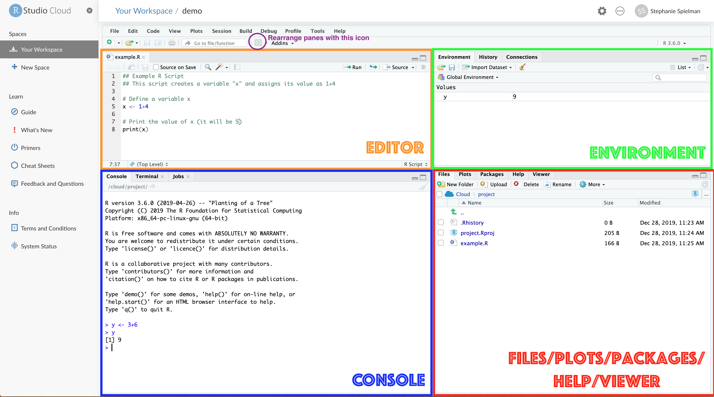

```{r setup, include=FALSE}
knitr::opts_chunk$set(echo = TRUE, collapse=TRUE)
if (!("emo" %in% installed.packages())) {
  library(remotes)
  install_github("hadley/emo")
}

library(emo)
```


## Other resources

Here are some other great resources for introducing R, but please be aware that not all of the content introduced below will be *specifically* relevant to our class. It is definitely *all* relevant to fully mastering R, however.


+ [Why use R?](https://cfss.uchicago.edu/setup/what-is-r/)
+ [More! Why use R?](https://www.guru99.com/r-programming-introduction-basics.html)
+ [R Basics](https://stat545.com/r-basics.html) from the STAT545 course by Jenny Bryan at UBC
+ [Introduction to R](https://datacarpentry.org/R-ecology-lesson/01-intro-to-r.html) from Data Carpentry
+ [Starting out with R](https://monashbioinformaticsplatform.github.io/r-intro/start.html)
+ [R Tutorial](https://kingaa.github.io/R_Tutorial/)

## What is R?

**R** is a statistical computing language that is _open source_, meaning the underlying code for the language is freely available to anyone. You do not need a special license or set of permissions to use and develop code in R. 

R itself is an _interpreted computer language_ (we will come back to this concept later in the semester) with a full set of programming features, which we refer to as **"base R"** - the functionality that comes bundled with the language itself. There is rich additional functionality provided by **external packages**, or libraries of code that assist in accomplishing certain tasks. These packages, also referred to as libraries, can be freely downloaded and loaded for use. Much of this workshop will be focused on learning how to use some really important data science packages, including [`ggplot2`](https://ggplot2.tidyverse.org/) for data visualization and [`dplyr`](https://dplyr.tidyverse.org/) for data manipulation and "wrangling."


### What is RStudio?

RStudio is a _graphical environment_ ("integrated development environment" or IDE) for writing and developing R code. RStudio is NOT a separate programming language - it is an interface we use to facilitate R programming. In other words, you can program in R without RStudio, but you can't use the RStudio environment without R.

For more information about RStudio than you ever wanted to know, see this [RStudio IDE Cheatsheet](https://d33wubrfki0l68.cloudfront.net/0dc0efccfaf638de8be4ce43e2bab8a91541d3d2/c4fdc/wp-content/uploads/2018/08/rstudio-ide.png).

### Obtaining and Using R/RStudio

There are two main paths to developing in R within the RStudio environment:

1. Use RStudio _in the browser_ via [rstudio.cloud](rstudio.cloud). Make your free account on this website and you can get started right away. **For this class, we will be using RStudio Cloud!** This option requires NO downloads at all.

2. Download and install _both_ R and RStudio (in that order!) to your local machine. This requires some amount of computer knowledge, and not all computer operating system versions will be compatible. **If you anticipate serious R usage in your future, you will eventually want to do this.** 
    + [Link to download R](https://cran.r-project.org/mirrors.html)
    + [Link to download RStudio](https://rstudio.com/products/rstudio/download/) (click the free version!)


## The RStudio Environment


The RStudio environment has four main **panes** (their specific location can be changed under Tools -> Global Options -> Pane Layout).
 

This image presents the **RStudio Cloud** environment within a project I have created called "demo" and an _R script_ called "example.R". 


1. The **editor** pane is where you can write R scripts and other documents. This is your _text editor_, which will allow you to save your R code for future use. R scripts can also directly be run from this pane. In this image, you can see an R script called "example.R" which contains some simple R to define and print a variable. **But be aware**, when there is no file open, this pane will automatically collapse and disappear from view. You can always open it again by opening a file.

2. The **console** pane is where you can _interactively_ run R code. You can also use this pane as a **terminal** to emulate a UNIX shell (please ignore this if you are unfamiliar with UNIX). In this image, you can see that the user has defined a variable called "y" and printed out its value. In the console, new lines where you can type code are indicated by greater than signs `>` - we do not type these symbols - R places them there to indicate a new line is starting. 

3. The **environment** pane primarily displays the variables, sometimes known as _objects_ you define during a given R session. You can ignore its other tabs for now. In this image, you can see that a variable "y" has been created with the value "9" (see the "console" code?). You'll also notice that the variable "x" is _not_ listed in the environment pane - that's because the script "example.R" has only been written but not (yet!) run, so R doesn't know about it.

4. The **files, plots, packages, help, viewer** pane has several tabs all of which are pretty important:
    + The **files** tab shows the structure and contents of your _current directory_ (i.e. folder). In the example image, the user is working in a directory (folder!) called "project", and this directory contains THREE files: .Rhistory, project.Rproj, and example.R - the file shown in the editor pane. For now, don't worry about what the first two files are.
    + The **plots** tab will reveal plots when you make them
    + The **packages** tab shows which installed packages have been loaded into your R session
    + The **help** tab will show the help page when you look up a function
    + The **viewer** pane will reveal compiled RMarkdown documents (stay tuned 2 more weeks)


You can change your preferred panel organization by clicking on the "grid" icon, which reveals a dropdown menu for moving panes to your preferred side (left/right) or layer (top/bottom).


## Basic Calculations

We will begin with _interactive coding_ to explore R's functionality. This means we will run R code directly in the console. This is fast and easy way to run code, but it also means that your code won't be saved. It's a great way to learn about using R, or to try out new skills you're just learning, but in general, it is **NOT** a good way to perform *reproducible analyses.*

### Comments

Arguably the __most important__ aspect of your coding is comments: Small pieces of explanatory text you leave in your code to explain what the code is doing and/or leave notes to yourself or others. Comments are invaluable for communicating your code to others, but they are most important for **Future You**. Future You comes into existence about one second after you write code, and has no idea what on earth Past You was thinking. Help out Future You by adding lots of comments! Future You next week thinks Today You is an idiot, and the only way you can convince Future You that Today You is reasonably competent is by adding comments in your code explaining why Today You is actually not so bad.

R will _ignore_ comments, which are indicated with hashtags. Anything on a given line that appears after a hashtag will be ignored, whether the hashtag is at the beginning of a line or in the middle of a line. You will see many comments in example code below!

### Mathematical operators

The most basic use of R is as a regular calculator:

| Operation | Symbol |
|-----------|--------|
| Add  | `+` | 
| Subtract  | `-` | 
| Multiply  | `*` | 
| Divide  | `/` | 
| Exponentiate | `^` or `**` | 

For example, we can do some simple multiplication like this. In this and following code chunks, the section with the gray background is R code, and the following white-background chunk is the code's output.
```{r}
12 * 10
```


## Working with variables


### Defining variables 

To define a variable, we use the _assignment operator_ which looks like an arrow: `<-`, for example `x <- 7` takes the VALUE on the right-hand side of the operator and ASSIGNS it to the VARIABLE NAME on the left-hand side. The opposite is also possible, e.g. ` 7 -> x`, as long as the arrow is pointing towards the VARIABLE NAME.
```{r}
# Define a variable x to equal 7, and print out the value of x
x <- 7
x

# This also works. Always point FROM the value, TO the variable.
7 -> x
x
```

Some features of variables, considering the example `x <- 7`:

 + Every variable has a **name**, a **value**, and a **type**. This variable's name is `x`, its value is `7`, and its type is `numeric` (7 is a number!). We will learn more about variable types soon.
 + Variable names can be any _string_, i.e. a set of characters (numbers, letters, and cerain symbols). Variables names should start with a letter, and it is best practice to avoid all symbols EXCEPT underscores. **Never use periods, dollar signs, or spaces. If you do, you will learn this the hard way.**
 + Variable names are _case sensitive_, meaning it matters if you use upper or lower case letters. If we try to access the variable `X` (capitalized), we will get an error because it is undefined:
 
    ```{r, error=TRUE}
    print(x) # works!
    
    print(X) # error :(
    ```

 + Re-defining a variable will OVERWRITE the value.
 
    ```{r}
    x
    
    x <- 5.5
    
    x
    
    ```

 + As best you can, it is a good idea to make your variable names informative (e.g. `x` doesn't mean anything, but `cost_of_sandwich` is meaningful... if we're talking about sandwich prices, that is..). Similarly, it is best practice to use underscores `_` to separate words if there are multiple words in the name.
 
 
### Variable Types

The example above defines a *numeric variable* - a variable whose value is a *number.* There are several other data types that values can have. Here are some of the most important types we'll need to know:

| Variable Type | Definition | Examples | Coersion |
|---------------|------------|----------| --------|
| `numeric`       | Any number value | `5`<br>`7.5` <br>`-1` <br> `pi` (This is a _constant variable_ defined in R as 3.1415...)| `as.numeric()`
|`character`      | Any collection of characters defined within _quotation marks_. Also known as a "string". | `"a"` (a single letter) <br>`"stringofletters"` (a whole bunch of characters put together as one) <br> `"string of letters and spaces"` <br> `"5"` <br> `'single quotes are also good'` | `as.character()`
|`logical`      | A value of `TRUE`, `FALSE`, or `NA` | `TRUE` <br> `FALSE` <br> `NA` (not defined) | `as.logical()` 
|`factor`       | A special type of data in R that denotes specific CATEGORIES of a categorical variable | (stay tuned..) | `as.factor()`

Variable types in R are what is known as "weakly typed", meaning when possible, you can _coerce_ (convert) one type to another.

For example, we can coerce an numeric to be a character:
```{r, error=TRUE}
x_numeric <- 15
class(x_numeric)

x_character <- as.character(x_numeric)
# See it now has quotes around it? It's now a character and will behave as such
x_character
class(x_character)

# aka, we can't add characters! even though "15" looks like a number, it's not
x_numeric + 4 # yay!
x_character + 4 # nope
```

<br>
But we can't coerce characters to be numerics:
```{r, error=TRUE}
# Define an integer
my_string <- "look at my character variable"
class(my_string)

# failed coersion. there is no natural way for a sentence to be numbers
# R decided the it's numeric version is undefined: NA
as.numeric(my_string)
```


## Logical variables and operators

One of the most important variable types are _logical variables_ (known as "boolean" in many other languages). They help us to compare different quantities and there is a special set of operators for performing comparisons that _return logical values_:

| Operator | What it does |
|----------|--------------|
 `==`           |  Tests if two quantities are EQUAL. <br> **DOUBLE EQUALS SIGN IS SO IMPORTANT. DOUBLE. ~NOT SINGLE~** |
  `>` and `<`   |  Tests if one quantity is greater than or less than another |
  `>=` and `<=` |  Tests if one quantity is _greater than or equal to_ or _less than or equal to_ another |
`!`             |  Negates an operation |  

Let's examine their usage:

```{r, error=TRUE}
5 == 5

7 >= 9

4 < 8

!(4 > 8)  # 4 is not greater than 8. Inside parentheses is FALSE, but the `!` negates the FALSE --> TRUE

# Your most common mistake: Using a single equals sign to compare values.
# R says you can't define a variable called 4 and make it equal 3. 4 is already a thing. It's 4.
4 = 3
```


### Multiple logical operations

Logical conditions can also be _combined_ with one another to make more involved True/False comparisons. For example, what if we want all values `X` where `5 < X < 20`? This will require a more complex logical expression and the knowledge of two primary concepts: 

+ **and** is True when BOTH conditions are True. (represented in R with the symbol `&`) 
+ **or** is True when AT LEAST ONE condition is True (represented in R with the symbol `|` located on the backslash key! This is *not* the letter L or number 1; it is a "pipe" operator.)

For example:
```{r}
############# and #################
10 > 5 & 5 == 5 ## Both are TRUE. 

10 < 5 & 5 < 2 ## Both are FALSE.

10 < 5 & 5 > 2 ## First is FALSE, second is TRUE.

# Remember, use a _leading_ ! to negate
10 > 5 & !(5 < 2) ## Both are TRUE. 


############ or ##############
10 == 10 | 10 == 11  ## First is TRUE, second is FALSE.

10 == 10 | !(10 == 11) ## First is TRUE, second is TRUE.

10 < 4 | 10 == 11  ## First is FALSE, second is FALSE. 


########### get crazy with it ###########
!(10 < 4 & 77 == 33)   # Within parentheses evaluates to FALSE, but the external ! changes things..
```


## Functions
We can use pre-built computation methods called "functions" for other operations. In fact, we've already seen and used one - the `print()` function.

Functions have the following format, where the _argument_ is the information we are providing to the function for it to run.
```{r, example-function, eval=FALSE}
function_name(argument)

# Sometimes there are multiple arguments
function_name(argument1, argument2, argument3)
```

To learn about functions, we'll examine one called `log()` first. 

To know what a function does and how to use it, use the question mark which will reveal documentation in the **help pane**: `?log`
 

The documentation tells use that `log()` is derived from `{base}`, meaning it is a function that is part of base R. It provides a brief description of what the function does and shows several examples of to how use it.

In particular, documentation tells about how what argument(s) to provide:]

+ The first _required_ argument is the value we'd like to take the log of, by default its _natural log_
+ The second _optional_ argument can specify a different base rather than the default `e`:

```{r}
# Natural log of 2:
log(2)

# Log of 2 in base 10:
log(2, 10)
```

Functions also _return_ values for us to use. In the case of `log()`, the returned value is the log'd value the function computed.

**One way you can tell the difference between variables and functions is that functions always have PARENTHESES, but variables do not!!**

## Arrays/vectors

You will have noticed that all your computations tend to pop up with a `[1]` preceding them in R's output. This is because, in fact, all (ok mostly all) variables are _by default_ **arrays** aka vectors, and our answers are the first (in these cases only) value in the array. As arrays gets longer, new index indicators will appear at the start of new lines. **See [here](https://r4ds.had.co.nz/vectors.html) for a deeper dive into array structures.** 

```{r}
# This is actually an array that has one item in it.
x <- 7

# The length() functions tells us how long an array is:
length(x)

# In fact, a single STRING has a length of ONE!! Compare the new function `length()` to `nchar()`
name <- "Stephanie"
nchar(name)
length(name)
```

We can define arrays with the function `c()`, which stands for "combine". This function takes a comma-separated set of values to place in the array, and returns the array itself:

```{r}
my_numeric_array <- c(1,1,2,3,5,8,13,21)
my_numeric_array
length(my_numeric_array)

# Combining two arrays will make one BIGGER array, not a nested array
my_array_of_arrays <- c(my_numeric_array,  c(100,101,102))
my_array_of_arrays
length(my_array_of_arrays)

# We can build on arrays in place by redefining them
my_numeric_array <- c(my_numeric_array, 10000)
my_numeric_array
```

If you want to quickly make an array of whole numbers in ascending order, you can also use a colon as `low:high`:
```{r}
values_1_to_20 <- 1:20
values_1_to_20
```

One major benefit of arrays is the concept of **vectorization**, where R by default performs operations on the _entire array at once_. For example, we can get the log of all numbers 1-2 with a single, simple call, and more!

```{r}
log(values_1_to_20)

# Multiple all items by 10
10 * values_1_to_20
```


Finally, we can apply logical expressions to arrays, just we can do for single values.

```{r}
# Define an array of values ranging from 2-8
example_array <- 2:8 
example_array

# Which values are <= 3?
# The output here is a LOGICAL ARRAY telling us whether each value in example_array is TRUE or FALSE
example_array <= 3
```

### A note on protected variables
A key concept that emerges here is **protected variables**. We have learned functions such as `c()`, `length()`, `log()`, etc. and more. Many computer languages recognize these names as protected - they are implicitly part of the language and are not allowed to be used for any other purpose, such as variable names. **R does not have this level of protection - it very much hopes you will not do this stupid thing, but it will NOT prevent you from doing it.** Imagine defining a variable called `c`: This will work, but it will lead to a LOT OF UNINTENDED BUGS. **CHOOSE YOUR VARIABLE NAMES WISELY!**

### A new logical operator: `%in%`

R has a special logical operator (a symbol like `==` or `<` that asks if something is TRUE or FALSE) that we can use for arrays. This operator `%in%` (percent-"in"-percent) asks if a given value is *in* an array. Some examples of using this operator are below:

```{r}
array_of_numbers <- c(100, 500, 200, 600, 900)

# Is the number 10 in the array? No!
10 %in% array_of_numbers

# Is the number 100 in the array? Yes!
100 %in% array_of_numbers

# Also works with strings:
array_of_strings <- c("a", "b", "c", "d", "e")

"a" %in% array_of_strings

# R is case-sensitive, meaning "a" is different from "A"
"A" %in% array_of_strings

"f" %in% array_of_strings
```


## Conditional variable definitions

This section introduces the handy function we'll make use of in this class, `ifelse()`. This function allows you to define a variable *based on a certain logical statement* (thing that is `TRUE` or `FALSE`). Here's the anatomy of the function, which takes *three* arguments:

`ifelse(<logical statement>, <value if the statement is TRUE>, <value if the statement is FALSE>)`

Some example of using this function are below:

```{r}
# Will return 10 if 5 == 5 is TRUE, and 20 if 5==5 is FALSE
result <- ifelse(5==5, 10, 20)
result


example_array <- c(1, 3, 5, 7)
# Will return "yes" if it is TRUE that example_array has a length of 1, and "no" otherwise
result2 <- ifelse( length(example_array) == 1, "yes", "no")
result2
```


## Data frames

_Data frames are the most fundamental unit of data analysis in R._ They are tables which consist of rows and columns, much like a _spreadsheet_. Each column is a variable which behaves as a _vector_, and each row is an observation. The type `data.frame` is itself a datatype in R, but we will (soon) be using a related datatype called a `tibble`: This is effectively a data frame within the tidyverse framework that just has a couple features that make it easier to use than a regular old data frame.

We will begin our exploration with the old trusted dataset `iris`, which comes with R. Learn about this dataset using the standard help approach of `?iris`.

### Exploring and indexing data frames

The first step to using any data is to LOOK AT IT!!! RStudio contains a special function `View()` which allows you to literally VIEW a variable. Try it out with `View(iris)`. You'll see a new table pop up in the "editor" pane:
![iris][img/irisview.png].

As you can see, there are FIVE columns and 150 rows in this data frame. While `View()` is convenient, there are also more dynamic ways of exploring our data which do not require specialized RStudio features. Some useful functions include:

+ `head()` to see the FIRST 6 rows of a data frame. Additional arguments supplied can change the number of rows.
+ `tail()` to see the LAST 6 rows of a data frame. Additional arguments supplied can change the number of rows.
+ `names()` to see the COLUMN NAMES of the data frame.
+ `nrow()` to see how many rows are in the data frame
+ `ncol()` to see how many columns are in the data frame.

Try each of these out the `iris` dataframe. 

<br>
We can additionally explore _overall properties_ of the data frame with two different functions: `summary()` and `str()`.

```{r}
# This provides summary statistics for each column (we'll learn more about these quantities soon)
summary(iris)

# This provides a short view of the contents of the data frame
str(iris)
```

You'll notice that the column `Species` is a _factor_: This is a special type of character variable that represents distinct categories known as "levels". We have learned here that there are three levels in the `Species` column: setosa, versicolor, and virginica. 

<br>
We might want to explore individual columns of the data frame more in-depth. We can _index_ these columns using the dollar sign `$`:

```{r}
# Extract Sepal.Length as a vector
iris$Sepal.Length

# We can perform our regular array operations on columns directly, e.g:
mean(iris$Sepal.Length)

# We can also achieve summary statistics for a single column directly. 
# For now, you are probably comfortable with all output except "1st Qu." and "3rd Qu."
summary(iris$Sepal.Length)

# Extract Species as a vector
iris$Species

# And view its _levels_ with the levels() function:
levels(iris$Species)
```


## Writing Scripts

So far, we have been directly typing code into the console and interactively examining its output. While this is tremendously valuable for a) getting comfortable with R, and b) trying out different coding strategies, _it is not a good idea long term_. Future You wants to be able to look back at your code, but if Today You types directly into the console, Future You will never know about it.

This is one of the many reasons we use **scripts** for portable programming. These are _plain text files_ containing code which should ONLY be created and used in appropriate _plain text editors_ - one of these exists implicitly within RStudio! 
<br><br>
`r emo::ji("clap")` **MICROSOFT** `r emo::ji("clap")` **WORD** `r emo::ji("clap")` **IS** `r emo::ji("clap")` **NOT** `r emo::ji("clap")` **A** `r emo::ji("clap")` **TEXT EDITOR.**  `r emo::ji("clap")`
<br>
`r emo::ji("clap")` **PAGES** `r emo::ji("clap")` **IS** `r emo::ji("clap")` **NOT** `r emo::ji("clap")` **A** `r emo::ji("clap")` **TEXT** `r emo::ji("clap")` **EDITOR.** `r emo::ji("clap")`
<br>
`r emo::ji("clap")` **GOOGLE DOCS** `r emo::ji("clap")` **IS** `r emo::ji("clap")` **NOT** `r emo::ji("clap")` **A** `r emo::ji("clap")` **TEXT** `r emo::ji("clap")` **EDITOR.** `r emo::ji("clap")`
<br><br>
If you would like to download a text editor separate from RStudio's built-in option, I recommend [BBEdit](https://www.barebones.com/products/bbedit/) for Mac, [Sublime3](https://www.sublimetext.com/3) for Windows, or [Visual Studio Code](https://code.visualstudio.com/) for either platform.


### Creating and running scripts

To create an R script to edit and run from within the RStudio environment, click the White Icon with the green plus sign and select "R Script" from the dropdown. 


You can now type code as you normally would in this script. Code can be executed in two ways from this script (see icons in upper-right corner of "editor" pane in the image above):

1. The **Run** button will execute code that you have _highlighted_. If nothing is highlighted, **Run** will run the code that your cursor is currently on. _Bear in mind, if your highlighted code depends on non-highlighted code, you will get an error!_ A shortcut for run is cmd+Enter. It makes code very easy to run!

2. The **Source** button will execute all code in the entire script.

When writing scripts, to view _any_ output, you MUST use the `print()` function. In interactive environments, simply typing a variable name will automatically reveal its value. This is NOT the case in scripts, so you must always print print print PRINT PRINT PPPPRRRRIIIINNNTTTT!!! **If you learn nothing else in this workshop, you will learn to PRINT. It's _that_ important**.


