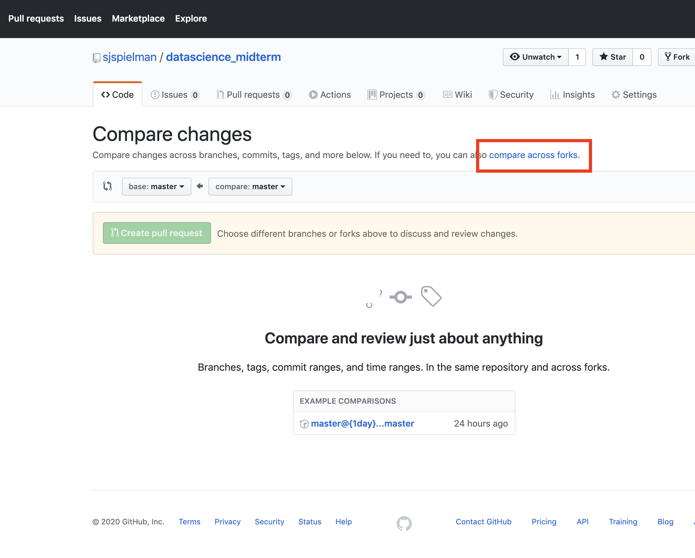
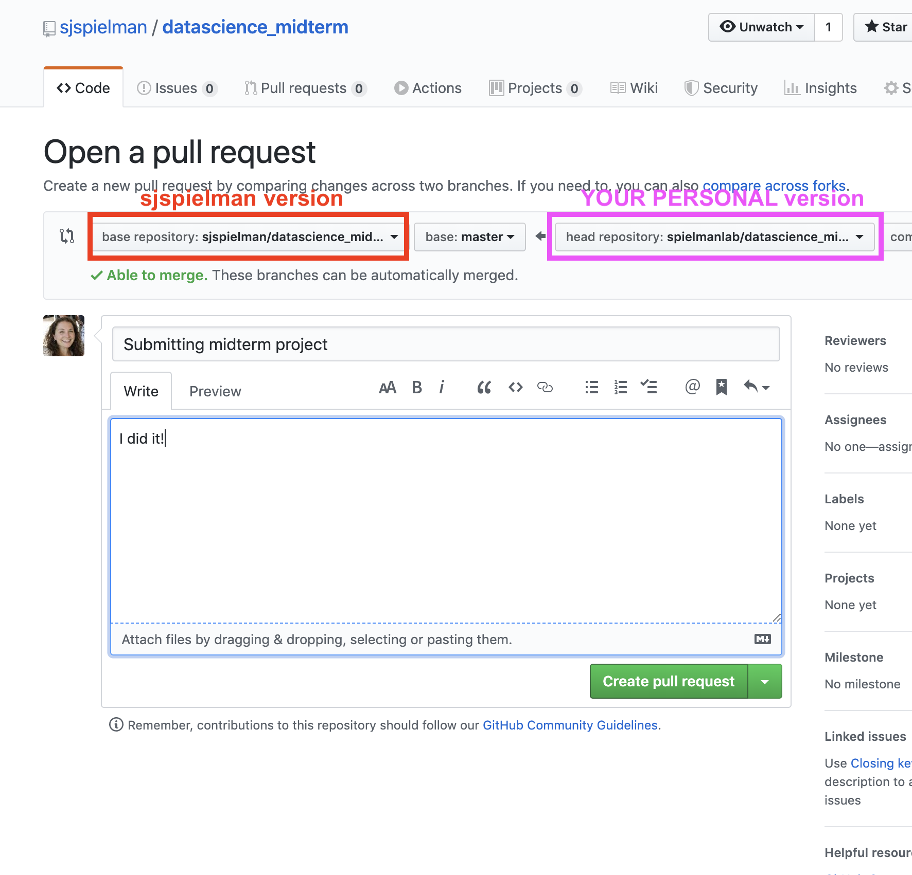

```{r setup, include=FALSE}
knitr::opts_chunk$set(echo = TRUE)
```


## Part One: The individual github workflow

> CAUTION: The directory shown in the Files Pane will NOT always correspond to where you are in Terminal. Regularly using `ls` and `pwd` will help you find where you REALLY are in Terminal - this is the one that matters!

0. Create a new RStudio Cloud project where you can do this work, so that your history will be saved! You can also work locally, your call! Going forward, these instructions will use the phrase "your computer" to mean: Wherever you are working!!


<br>
1. Within your account on [github.com](github.com), create a new repository (public or private, doesn't matter) called **my_first_repo**. Please do give it this exact name - it will help with interpreting instructions for consistency!!

  + **YES**: Click the box "Initialize this repository with a README"
  + Do not worry about the `.gitignore` or `LICENSE` options - you do not need them.
  
<br>
2. On your computer (aka cloud or locally!), **clone** the repository by typing: `git clone <URL-TO-YOUR-REPOSITORY`. For example, I will write: `git clone https://github.com/sjspielman/my_first_repo`. This will "download" the repository to your computer.

  + NOTE: There are two ways to download, either with the `HTTPS://` or the `SSH` protocol. We will use the former. The difference is beyond the scope of the class, but [see here](https://help.github.com/en/github/using-git/which-remote-url-should-i-use) for an explanation.
  + Do NOT click "Set up in Desktop" on the website. We are using command line only!!
  + NOTE: You can not clone a repository into a folder that is already another repository. This isn't relevant now/yet, but one day it could be!

<br>
3. Using `cd`, navigate into the repository. Run `pwd` to confirm you have entered the `my_first_repo` directory, and then run `ls -la` to view all files, including hidden files, in the repository. You will see:

  + The `README.md` file you initialized the repository with
  + A hidden directory called `.git/`: This is where the git magic happens and old commit verions are stored. **NEVER EVER TOUCH THIS DIRECTORY. LEAVE IT ALONE.**
  + **All work going forward MUST be done inside the repository** (i.e. inside `my_first_repo/`). 

<br>
4. Create a new Rmarkdown file from the RStudio Template:

  + The name should be "Practice Plotting and Github", and you should have HTML output. NOTE: the "name" you are prompted is the title that the document will have, not the same as the file name you will save it as
  + Save the file as `practice_plot_github.Rmd`. and spend 10-15 minutes making it your own:
    + Delete the header `## Including Plots` and everything afterward
    + Load tidyverse into the setup chunk, and if you wish set a global ggplot theme
    + In the existing `cars` chunk, *rename* the chunk to something more meaningful, and within that chunk make a ggplot of any kind using a built-in dataset. Some ideas (using datasets we've already seen):
      + Literally anything with `iris`
      + Literally anything with `diamonds`
      + Literally anything with `CO2`
      + Literally anything with `msleep`
    + You **must** save the plot with `ggsave(<output_file_name.pdf>, <name_of_plot_variable>)`. **Name the output file `practice_plot.png`**.

<br>
5. Knit the document, confirm it knits properly, and the file has been saved. There should now be THREE new files in your repository:
    
  + `practice_plot_github.Rmd`
  + `practice_plot_github.html`
  + `practice_plot.png`

<br>
6. Run `git status` to see how your repository has changed. You will see that these three files are *untracked*: They are present but git does not yet know about them to keep under version control.

<br>
7. So, we will now place these files under version control with: `add` (hey git track this file!), `commit` (take a snapshot now!), and then `push` (send to github.com) .
  
  Run the following three separate commands (always run `git add` PER FILE!!!)
  ```{bash, eval=F}
  git add practice_plot_github.Rmd
  git add practice_plot_github.html
  git add practice_plot.png
  ```
  Again, run `git status`: You will see these three files are now being tracked.

<br>
8. Make your first commit with an *informative message* such as: `git commit -m "Adding first version of plotting rmarkdown, knitted html, and output plot."`. You need quotes there, but single or double doesn't matter (just be consistent).
    
  + If you get stuck in a scary scary screen, WOOPS. Type literally: `[esc]:wq`. The escape button, a colon, w, and q. You *should* now be free. Good luck.

<br>
9. Again, run `git status` and you should see: `Your branch is ahead of 'origin/master' by 1 commit.`. AKA, what's on your computer is 1 commit ahead of the website! Good! Let's send this commit to the website with `git push`. You will be prompted for your GITHUB username and GITHUB password. Hope you remembered it!!

<br>
10. Head back to github.com and look at your repository - see, you did it!!

<br>
11. **Within github.com itself**, modify the `README.md` file to contain a bulleted list describing the files in your repository. Do this by clicking the `README.md` file in the file list, and then click the pencil icon in the top right of the file. This will allow you to make changes, and preview them before you commit (haha pun!) to those changes. When you are satisfied, click "Commit changes". **This is the equivalent of working with your repository on multiple computers.**

<br>
12. Return to your computer's repository and run `git pull` to update your local version with the changes made on that "other computer" (aka the website directly). Then, run `git log` to see a full history of what has happened so far. Exit this screen by pressing the `q` key.

<br>
13. Open your Rmd file, and *minorly modify the plot* (i.e. change a color or fill, something quick!!). Re-knit the file, and run `git status` - there are now _modifications_ to files that are under version control. We need to be explicit with git and add these files again to track the changes:
    
  + Again, run `git add` on all modified files
  + Run `git commit -m "another very meaningful message"`
  + Run `git push` (and if still prompted, give username and password).

<br>
14. Head back to github.com and browse through the "Commits" tab to see it's all there :)


---------------------------------


## Part Two: Midterm Project Setup and first commit

1. In your browser, go to the project URL [https://github.com/sjspielman/datascience_midterm](https://github.com/sjspielman/datascience_midterm). In the top right corner, click the "Fork" button. This will give you YOUR OWN version of this repository that lives at `https://github.com/<yourgithubaccount>/datascience_midterm`. 

2. In RStudio Cloud, click the *dropdown arrow* part of the "New Project" button and click "New Project from Git Repo". Then, enter the URL for **your forked version** - NOT MINE!!! SERIOUSLY, YOURS AND NOT MINE. REALLY REALLY REALLY IMPORTANT. **UNCLICK the button "Add packages from the base project".** It's ok if you don't, but you may need to delete some extraneous files you don't need. 

3. A new project that contains the repo automatically will now be made for you. How convenient!! **You are now FOREVER working in the repository when you enter this project.** You will notice the directory still is `/cloud/project/` and not the repository name - that's fine! It's still the repo. You can name this project something reasonable like "midterm." 

4. Let's get set up for the midterm project **using UNIX commands** in Terminal:

    + Make a new directory called `<lastname_firstname>`, e.g. I would type: `mkdir spielman_stephanie`.
    + **Move** the files `tidy_exclusion_data.R` and `plot_exclusion_data.Rmd` into this directory, but make this move **with the `git` version of the command.** This will automatically "add" the change of path towards a commit, and it automatically will know about the new directory you made:
      ```{bash, eval=F}
      git mv tidy_exclusion_data.R <lastname_firstname>
      git mv plot_exclusion_data.Rmd <lastname_firstname>
      ```
    + Run `git status` to make sure this move is under version control! **If you did not type `git` when moving the first time**, you will need to `git add` the files that are now in your name's directory, and `git rm` the files you left behind. Likely you'll want to talk to Dr. Spielman ASAP for this. It can be fiddly.
    + Run `git commit -m "First project commit moved files into my directory"` (or a similarly informative message)
    + Run `git push` to send the changes over to github.com

5. Let's get set up with R by heading to Console and installing some packages:
    ```{R, eval=F}
    ## tidyverse, flipbook engine xaringan, and remotes for obtaining flipbookr
    install.packages(c("tidyverse", "xaringan", "remotes")) 
    
    ## steps to install flipbookR:
    library(remotes)
    install_github("EvaMaeRey/flipbookr")
    ```
  You are all set with baseline packages! Come back to Console to install more - **do NOT put install lines into the project code EVER!**
  

5. For the project, you will now DIRECTLY work with those two scripts that now live in your directory! The RMarkdown document you make for your flipbook should also be in that directory. **Basically, never do ANYTHING outside of your directory, and leave the raw_data where it is.** When you save files going forward, simply use the `add`, `commit`, `push` workflow! Happy github'ing!
  + If you change something OUTSIDE of your folder, the final pull request will not be accepted and you won't be able to submit your midterm project correctly, leading to an automatic -50%. 


#### To submit your project: 
  
  + ONLY DO THIS WHEN YOU ARE ACTUALLY READY TO SUBMIT. ONE ATTEMPT AT SUBMISSION ALLOWED ONLY!!
  + Go to MY original URL [https://github.com/sjspielman/datascience_midterm](https://github.com/sjspielman/datascience_midterm).
  + Click the "Pull Request" (PR) tab at the top of the page.
  + Click the green "New pull request" button
  + Then click the link "compare across forks": 
      <br>
      {width=400px}
      <br>
  + In the next screen, the "base repository" should be the `sjspielman` account, and the **head repository should be yours**. This will be automatic. All the "compare" dropdowns will say "master."
  + This screen SHOULD reveal a green check mark "Able to merge." If it does NOT say this, it means you messed files OUTSIDE OF YOUR DIRECTORY - THAT WAS BAD!!!!! EMAIL ME ASAP.
  + At this point click the "Create Pull Request" button, and you will be greeted with a screen to write a title for this PR and a brief message just like a commit. Something short and sweet like "midterm project submission" is fine here. Click "Create pull request", and voila you have submitted!
      <br>
      {width=400px}
      <br>

