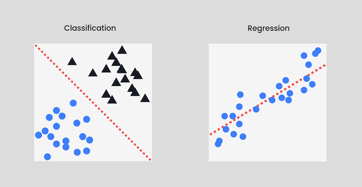
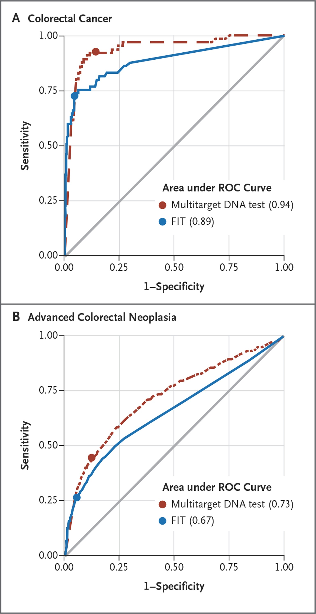

```{css, echo=F}

@media print {
  .has-continuation {
    display: block !important;
  }
}


pre {
  white-space: pre-wrap;
  
}

ul:first-child, ol:first-child {
    margin: 0;
}


.remark-code, .remark-inline-code { 
    color: #326369;
    font-weight: 600;
}
/* Code block code */
.hljs .remark-code-line { 
  font-weight: normal;
  font-size: 15px;
}

.pull-left2{
  float: left;
  width: 85%;
}

.pull-right2{
  float: right;
  width: 30%;
}
```

```{r setup, include=FALSE}
knitr::opts_chunk$set(echo = TRUE, collapse=TRUE)
library(tidyverse)
library(broom)
library(xaringan)
theme_set(theme_bw())
```


## Linear regression vs. logistic regression

+ Linear regression: How much do these (linearly-related) predictors explain variation in my *numeric* response variable?
  

+ Logistic regression: How well do these predictors explain variation in my *categorical __binary__* response variable?
  + E.g. predicting Species in the iris dataset would be a categorical predictor, but NOT binary
  + Type of classifier

---


## Where are we in the "machine learning" universe?


+ Machine learning = the computer learns through experience
 + More data = more experience! *Training models on data IS machine learning*
 + Ignore the AI hype.


.pull-left[
```{r out.width = '500px', echo=F}
knitr::include_graphics("img_logistic/ML_super_unsuper.png") 
```
]

.pull-right[
```{r out.width = '500px', echo=F}

```
]

---
## Logistic regression
  
  
```{r out.width = '400px', echo=F}
knitr::include_graphics("img_logistic/logit_transform_fromlinear.png")
```

+ Linear regression: $Y =  \beta_0 + \beta_1X_1 + \beta_2X_2 + \beta_3X_3 ... + \beta_NX_N + \epsilon$

--

+ Logistic regression *transforms the predictors* 
  + $t =  \beta_0 + \beta_1X_1 + \beta_2X_2 + \beta_3X_3 ... + \beta_NX_N + \epsilon$
  + $Y = \frac{1}{1 + e^{-t}}$ (or, $p = ...$ in image)

---

```{r, warning=FALSE, message=FALSE}

# too large to fit on slide..
data_url <- paste0("https://raw.githubusercontent.com/sjspielman/",
                   "datascience_for_biologists/master/docs/",
                   "fall2020/slides/biopsy.csv")
                   
biopsy <- read_csv(data_url)

dplyr::glimpse(biopsy)
```

---

## Building the logistic regression: Prepare the data

```{r}
## Ensure the column is a factor, OR it has 0/1 values
## Help yourself by coding success = 1, failure = 0. This way you don't need alphabetical order
biopsy %>%
  mutate(outcome_01 = case_when(outcome == "malignant" ~ 1, # "success" 
                                outcome == "benign" ~ 0)) %>%
  select(-outcome) %>%
  select(outcome_01, everything()) -> biopsy_outcome01

head(biopsy_outcome01)
```

---
## Building the logistic regression: Build the model

**`glm(response ~ predictors, data = data, family = "binomial")`**

```{r}

baseline_logit_fit <- glm(outcome_01 ~ ., data = biopsy_outcome01, family = "binomial")

fit <- step(baseline_logit_fit, trace = F) # Read "Introduction to Model Selection"!!
```

---

## Interpreting the logistic regression coefficients

```{r}
broom::tidy(fit)
```

+ For every unit increase in the predictor, the **log odds of success** of the response increases by the coefficient
 + $Pr(success)$ = probability of *malignant* biopsy for a given set of observations (predictors)
 + $Pr(failure)$ = probability of *benign* biopsy for a given set of observations 
 + **Log odds = $ln\bigg(\frac{Pr(success)}{Pr(failure)}\bigg)$**


---

## Visualizing the logistic regression

```{r out.width = '600px', echo=F}
knitr::include_graphics("img_logistic/logit_transform_fromlinear.png")
```


---

```{r}
## USING head() to make it fit on slides!!

## What would have been your Y-values if this were regression
## YOUR X-AXIS !!
head(fit$linear.predictors) #<<

## The logit transformed - PROBABILITIES OF SUCCESS
## YOUR Y-AXIS !!
head(fit$fitted.values) #<<
```

--

+ $t =  \beta_0 + \beta_1X_1 + \beta_2X_2 + \beta_3X_3 ... + \beta_NX_N + \epsilon$
+ $Y = \frac{1}{1 + e^{-t}}$ 

--

```{r}
1/(1 + exp(-1 * fit$linear.predictors)) %>% head()
```

---


## Visualizing the model: Prepare the data

```{r, fig.width = 6, fig.height = 4}
tibble(x = fit$linear.predictors, 
       y = fit$fitted.values, 
       # Helps to use the ORIGINAL biopsy version so that outcome is "malignant"/"benign"
       outcome = biopsy$outcome) -> fit_tibble

fit_tibble
```

---

## Visualizing the model

.pull-left[
```{r, fig.width = 6, fig.height = 4}
head(fit_tibble)
```
]

.pull-right[
```{r, fig.width = 6, fig.height = 4}
ggplot(fit_tibble, aes(x = x, y = y)) + 
 geom_line() +
 theme(legend.position = "bottom")
```
]
---

## Visualizing the model FULLY!!!
.pull-left[
```{r, fig.width = 6, fig.height = 4}
head(fit_tibble)
```
]

.pull-right[
```{r, fig.width = 6, fig.height = 4}
ggplot(fit_tibble, aes(x = x, y = y)) +
 geom_line() +
 geom_point(aes(color = outcome)) +  #<<
 theme(legend.position = "bottom") + 
  labs(x = "Linear predictors",
       y = "Probability malignant")
```
]

---

## Confusion matrix time

```{r out.width = '350px', echo=F}
knitr::include_graphics("img_logistic/confusionmatrix.jpeg") 
```

+ **First ask:** is the result positive or negative? **Then ask:** should we have gotten that result though? 
  + If yes, *TRUE*. If not, *FALSE*.

---

## What is it?


A new arthritis drug does help pain clinical trials, even though it actually does reduce arthritis pain.

--

A person with HIV receives a positive test result for HIV.

--

A person using illegal performing enhancing drugs passes a test clearing them of drug use.

--

A study found a significant relationship between neck strain and jogging, when reality there is no relationship.

--

A healthy individual gets a positive cancer biopsy result.


---


## Classification metrics (an abbreviated set)

.pull-right2[
```{r out.width = '200px', echo=F}
knitr::include_graphics("img_logistic/confusionmatrix.jpeg") 
```
]

+ True positive rate: $TPR = TP/P = \frac{TP}{TP + FN}$
  + AKA *sensitivity* AKA *recall*

--


+ True negative rate: $TNR = TN/N = \frac{TN}{FP + TN}$
  + AKA *specificity*

--


+ False positive rate: $FPR = FP/N = \frac{FP}{FP + TN}$
  + AKA *1 - specificity*

--


+ Precision: $PPV = \frac{TP}{TP + FP}$
  + AKA *positive predictive value*

--


+ Accuracy: $\frac{TP + TN}{TP + TN + FP + FN}$

---

## Recall our model:

```{r}
# Recall:
biopsy %>%
  mutate(outcome_01 = case_when(outcome == "malignant" ~ 1, # "success" 
                                outcome == "benign" ~ 0)) %>%
  select(-outcome) %>%
  select(outcome_01, everything()) -> biopsy_outcome01
baseline_logit_fit <- glm(outcome_01 ~ ., data = biopsy_outcome01, family = "binomial")
fit <- step(baseline_logit_fit, trace = F) # Read "Introduction to Model Selection"!!

tibble(x = fit$linear.predictors, 
       y = fit$fitted.values, 
       outcome = biopsy$outcome) -> fit_tibble

head(fit_tibble)
```

---

## Caculating performance measures

+ Requires a *threshold* to call malignant/benign outcomes. 
+ For an example, let's say >=0.75 is malignant (success). <0.75 is benign (failure)
+ Accuracy: $\frac{TP + TN}{TP + TN + FP + FN}$

```{r}
threshold <- 0.75
fit_tibble %>% 
  rename(truth = outcome) %>%    #<< 
  mutate(pred = if_else(y >= threshold, "P", "N")) 
```


---
$Accuracy = \frac{TP + TN}{TP + TN + FP + FN}$

```{r}
threshold <- 0.75
fit_tibble %>% 
  rename(truth = outcome) %>% 
  mutate(pred = if_else(y >= threshold, "P", "N")) %>%
  mutate(classif = case_when(truth == "malignant" & pred == "P" ~ "TP", 
                             truth == "malignant" & pred == "N" ~ "FN",
                             truth == "benign"    & pred == "N" ~ "TN",
                             truth == "benign"    & pred == "P" ~ "FP")) -> model_classif

model_classif
```

---


```{r}
model_classif %>%
  # how many in each classif category?
  count(classif) 
```

$Accuracy = \frac{TP + TN}{TP + TN + FP + FN}$

+ Accuracy = (437 + 219) / (20 + 7 + 437 + 219) = **0.96**


--

.pull-left[
```{r}
model_classif %>%
  count(classif) %>%
  pivot_wider(names_from = classif, values_from = n) #<<
```
]

.pull-right[
```{r}
model_classif %>%
  count(classif) %>%
  pivot_wider(names_from = classif, values_from = n) %>%
  mutate(accuracy = (TP + TN)/(TP + TN + FP + FN))
```
]
---

## How good is the model?

+ In linear regression, we often uses $R^2$ values to compare different viable models. Higher $R^2$ often (but not always!) means, "more predictive model"


+ In logistic regression, performance **depends** on your chosen threshold! So, how do we choose a threshold?
  + Usually, find the threshold that makes the false positive rate <5%> 
+ We also use **AUC** (area under the curve... what curve?)

---


## Evaluating logistic regressions

.pull-left[
**Receiver Operating Characteristic** Curve
  + TPR on Y-axis
  + FPR (1 - specificity) on X-axis
  + The AUC (**a**rea **u**nder the **c**urve) is an overall assessment of performance *at any threshold*
]

.pull-right[
+ $TPR = TP/P = \frac{TP}{TP + FN}$ (*sensitivity* AKA *recall*)


+ $TNR = TN/N = \frac{TN}{FP + TN}$ (*specificity*)


+ $FPR = FP/N = \frac{FP}{FP + TN}$ (*1 - specificity*)
]

  
```{r out.width = '400px', echo=F}
knitr::include_graphics("img_logistic/roc-theory-small.png") 
```

+ ROC curves are used to evaluate performance of *ANY binary classifier* (not just logistic regression)

---

## Getting a "feel" for ROC curves

```{r out.width = '800px', echo=F}
knitr::include_graphics("img_logistic/roc_intuition.png") 
```

---

## Examples of ROC curves in the literature

.pull-left[
Keller et al. Genome Biol Evol 2012; 4:80-88 

```{r out.width = '300px', echo=F}
knitr::include_graphics("img_logistic/roc_keller.png") 
```
]


.pull-right[
Imperiale et al. N Engl J Med 2014; 370:1287-1297

```{r out.width = '225px', echo=F}
 
```
]


---

## ROC vs PR


+ ROC curves are suitable when data is *balanced*
  + Similar amounts of positives, negatives in the dataset
  + FPR (1 - specificity) on X-axis, TPR on Y-axis

+ **Precision-Recall** curves are more suitable for *unbalanced* data
  + Precision (PPV) on Y-axis, recall (TPR) on X-axis


<br><br>

+ $TPR = TP/P = \frac{TP}{TP + FN}$ (*recall*)
+ $FPR = FP/N = \frac{FP}{FP + TN}$ 
+ $PPV = \frac{TP}{TP + FP}$ 

---

## Is the biopsy data balanced?


```{r}
biopsy %>%
  count(outcome)
```
+ About 2:1::benign:malignant
+ Not very balanced, but it's reasonable. ROC is ok to use!

+ *Problematically imbalanced* would be 4000 benign and 5 malignant (or vice versa).


---

## Making ROC curves

+ Recall:
  + Our model fit is saved in `fit`
  + Our model was built with `biopsy_outcome01` dataset
  
```{r}
## Use the pROC library to help you
#install.packages("pROC")
library(pROC)
```

```{r}
# Use the function roc(), and data with the 0/1 coded outcome!!
model_roc <- roc(biopsy_outcome01$outcome_01, fit$linear.predictors) #<<

# This also works the same:
model_roc <- roc(biopsy_outcome01$outcome_01, fit$fitted.values) #<<
```

---

## Getting information out
```{r}
model_roc$auc
```
+ Models are usually *not this good.* This dataset comes from a package that teaches modeling - it was chosen for a reason...

--
```{r}
## Piped into head() to fit on the slide

## True positive rates
model_roc$sensitivities %>% head()

## True negative rates
model_roc$specificities %>% head()

## False positives rates
1 - model_roc$specificities %>% head()
```

---

## Make an ROC curve

```{r, fig.width = 5, fig.height = 4}
tibble(TPR = model_roc$sensitivities,
       FPR = 1 - model_roc$specificities) %>%
  ggplot(aes(x = FPR, y = TPR)) + 
  geom_line() +
  labs(title = "ROC curve to classify biopsy results",
       subtitle = paste("AUC =",round(model_roc$auc, 3)) ) +
  ## this is the y=x line to GUIDE US and help us interpret the curve
  geom_abline(col = "red")
```

---

## Using ROC to determine the reliable model

+ Build your candidate models 
+ Determine their AUC value using the pROC package
+ The highest AUC is the most reliable model
+ ...and of course, make a visualization!

---

## Build your candidate models


```{r}
names(biopsy_outcome01)

# fit1: Predict outcome with mitoses and clump_thickness, for example
fit1 <- glm(outcome_01 ~ mitoses + clump_thickness, data = biopsy_outcome01, family = "binomial")

# fit2: Predict outcome with mitoses and normal_nucleoli
fit2 <- glm(outcome_01 ~ mitoses + normal_nucleoli, data = biopsy_outcome01, family = "binomial")

# fit3: Predict outcome with mitoses, normal_nucleoli, and clump_thickness
fit3 <- glm(outcome_01 ~ mitoses + normal_nucleoli + clump_thickness, data = biopsy_outcome01, family = "binomial")
```

---

## Determine their AUC values

```{r}
fit1_roc <- roc(biopsy_outcome01$outcome_01, fit1$linear.predictors) 
fit1_roc$auc

fit2_roc <- roc(biopsy_outcome01$outcome_01, fit2$linear.predictors) 
fit2_roc$auc

fit3_roc <- roc(biopsy_outcome01$outcome_01, fit3$linear.predictors) 
fit3_roc$auc
```

---


## Visualize: Create the data for plotting

+ Need to combine all values into ONE tibble

```{r}
tibble(TPR = fit1_roc$sensitivities,
       FPR = 1 - fit1_roc$specificities, 
       model = "fit1") -> fit1_tibble

tibble(TPR = fit2_roc$sensitivities,
       FPR = 1 - fit2_roc$specificities, 
       model = "fit2") -> fit2_tibble

tibble(TPR = fit3_roc$sensitivities,
       FPR = 1 - fit3_roc$specificities, 
       model = "fit3") -> fit3_tibble

bind_rows(fit1_tibble, fit2_tibble) %>%
  bind_rows(fit3_tibble) -> final_tibble
```

---

## Visualize: Plot away!


```{r, fig.width = 6, fig.height=5}
ggplot(final_tibble, aes(x = FPR, y = TPR, color = model, group = model)) + 
  geom_line() +
  labs(title = "ROC curves for candidate models",
       x = "FPR", y = "TPR") +
  scale_color_brewer(palette = "Dark2") +
  ## this is the y=x line to GUIDE US and help us interpret the curve
  geom_abline()
```

