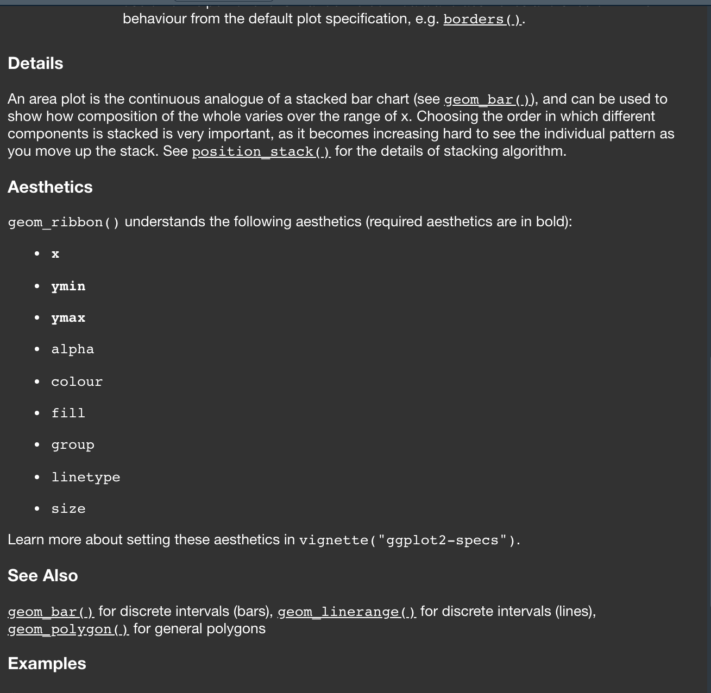
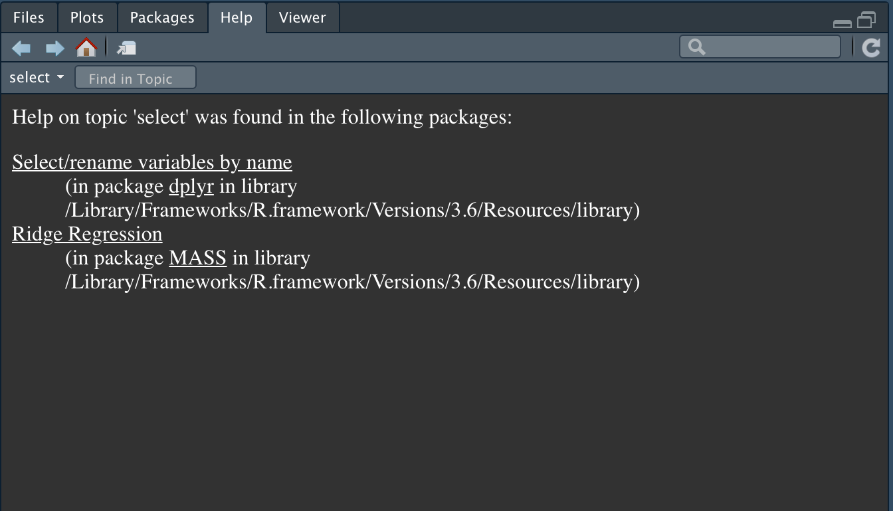

```{css, echo=F}
pre {
  white-space: pre-wrap;
}

ul:first-child, ol:first-child {
    margin: 0;
}


.remark-code, .remark-inline-code { 
    color: #326369;
    font-weight: 600;
}
/* Code block code */
.hljs .remark-code-line { font-weight: normal; }

.pull-left2{
  float: left;
  width: 60%;
}

.pull-right2{
  float: right;
  width: 35%;
}
```

```{r setup, include=FALSE}
knitr::opts_chunk$set(echo = TRUE, collapse=TRUE, fig.height = 4, fig.width = 5)
library(tidyverse)
library(xaringan)
library(patchwork)
```


## Where `geom` and `stat` meet

```{r}
ggplot(iris, aes(x = Sepal.Length)) + 
  geom_histogram(fill = "violet",   
                 color = "navy")    
```

---

## Where `geom` and `stat` meet

```{r}
ggplot(iris, aes(x = Sepal.Length)) + 
  stat_bin(fill = "violet",   #<<
           color = "navy")    #<<
```

---

## `?geom_histogram`


---

## Using `geom_freqpoly`

.pull-left2[
```{r plot-label, eval=FALSE}
ggplot(iris, 
       aes(x = Sepal.Length)) -> p_shared

p1 <- p_shared + 
        geom_freqpoly(color = "navy") #<<

p2 <- p_shared + 
       geom_histogram(fill = "violet", #<<
                      color = "navy") #<<

p3 <- p_shared + 
       geom_histogram(fill = "violet", #<<
                      color = "navy") + #<<
       geom_freqpoly(color = "black", #<<
                     size = 1)  #<<

p1 + p2 + plot_spacer() + p3 + plot_layout(ncol=1)
```
]

.pull-right2[
```{r plot-label-out, ref.label="plot-label", echo=FALSE, message=FALSE, fig.height=9, fig.width = 5}
```
]


---

## `?geom_histogram`


---

## Examining stat and geom interplay

```{r, message = F}
ggplot(iris, aes(x = Sepal.Length)) + 
  stat_bin(geom = "point",#<<
           color = "navy")#<<
```

---

## Examining stat and geom interplay

```{r, message = F}
ggplot(iris, aes(x = Sepal.Length)) + 
  stat_bin(geom = "point", 
           color = "navy") +
  stat_bin(geom = "line", #<<
           color = "red")#<<
```

---
## `?geom_area`
.pull-left[

]
---


## Examining stat and geom interplay

```{r, message = F, error=T}
ggplot(iris, aes(x = Sepal.Length)) +  
  geom_area(fill = "violet",
            color = "navy") 
```

---
## `?geom_area`
.pull-left[

]

.pull-right[

]

---


## Examining stat and geom interplay

```{r, message = F, error=T}
ggplot(iris, aes(x = Sepal.Length,
                 y = ..count..)) +   #<< 
  geom_area(fill = "violet",
            color = "navy")
```

---

## Examining stat and geom interplay

```{r, message = F}
ggplot(iris, aes(x = Sepal.Length,
                 y = ..count..)) +   #<< 
  geom_area(fill = "violet",
            color = "navy",
            stat = "bin") #<<
```

---

## `geom_bar` vs `geom_col`

Look it up and practice the same concepts!

---

## Best practices (a limited set)

+ Know your namespace
+ Use meaningful variable names
+ Avoid hardcoding 
+ Set checkpoints ("assertions")
+ Whenever you copy/paste more than twice, write a function

---

## Know your namespace

.pull-left[
```{r}
diamonds %>%
  select(cut)
```
]
```{r, include=F}
detach(package:dplyr)
library(magrittr)
library(MASS)
```
--

.pull-right[
```{r, error=T}
diamonds %>%
  select(cut)
```
]

---

## `?select`


```{r, include=F}
library(dplyr)
```
---

## For safety, be explicit with your namespace

```{r}
diamonds %>%
  dplyr::select(cut) #<<
```

```{r, include=F}
detach(package:dplyr)
detach(package:MASS)
library(MASS)
library(tidyverse)
```
---
## Know exactly the order R searches for commands/object

```{r}
search()
```

```{r}
detach(package:MASS)
search()
```
---

## Know where your conflicts are

```{r, include=F}
library(MASS)
```

```{r}
conflicts(detail = TRUE)
```

---

## Know where your conflicts are

```{r}
tidyverse_conflicts()
```

---


## Namespace and variables

```{r}
diamonds <- 25
```

.pull-left[
```{r, error=T}
head(diamonds)
```
]

.pull-right[
```{r}
head(ggplot2::diamonds)
```
]

```{r, include=F}
rm(diamonds)
```
---

## Use meaningful variable names

+ Reserve single letters for integers
  + `x <- 10`
  + NOT `x <- ggplot(...)`
  + NOT `x <- iris %>% filter(...)`

--

+ Use underscores for multiple words
  + `my_plot <- ggplot(...)`
  + NOT `myPlot`, NOT `myplot`, NOT `my-plot`, NOT `my.plot`

--

+ You should always be able to have a _sense_ of what a variable is from its name. It's fun to be fun, but too fun leads to bugs. Be KIND to:
  + **You**, returning to code after a week (or 2 minutes.)
  + **Others**, trying to interpret your code 

--

+ What do you think `sepal_histogram` is? **A histogram of sepals, somehow**
+ What do you think `sillypopculturereference` is? **haha funny! no clue.**


---

## Official styleguide

 [http://stat405.had.co.nz/r-style.html](http://stat405.had.co.nz/r-style.html)

---

## Avoid Hardcoding


You **love** seagreen and navy, so you use them everywhere!
```{r}
ggplot(iris, aes(x = Sepal.Length)) + 
  geom_histogram(fill = "seagreen",
                 color = "navy") -> p1

ggplot(iris, aes(x = Petal.Length)) + 
  geom_histogram(fill = "seagreen",
                 color = "navy") -> p2

ggplot(iris, aes(x = Petal.Width)) + 
  geom_histogram(fill = "seagreen",
                 color = "navy") -> p3
```

...But what happens if you change your mind?

---

## Avoid Hardcoding
```{r}
favorite_fill  <- "seagreen"
favorite_color <- "navy"

ggplot(iris, aes(x = Sepal.Length)) + 
  geom_histogram(fill = favorite_fill,
                 color = favorite_color) -> p1

ggplot(iris, aes(x = Petal.Length)) + 
  geom_histogram(fill = favorite_fill,
                 color = favorite_color) -> p2

ggplot(iris, aes(x = Petal.Width)) + 
  geom_histogram(fill = favorite_fill,
                 color = favorite_color) -> p3
```

---

## Avoid Hardcoding

+ If you use a **value** more than ONE TIME, make it a VARIABLE
+ Define at the **top** of your script or Rmarkdown (e.g. in setup chunk?)
  + Let's talk about scope real quick.
---

## Set checkpoints ("assertions")

+ Assertion are small checks you put in your code that make sure "is this thing that should be true actually true?"
  + If true, keep chugging along
  + If false, stop all program execution because something is _really_ wrong

--

```{r}
## What NEEDS to be true for this code to work?
mean(iris$Sepal.Length)
```

--

```{r}
typeof(iris$Sepal.Length)
```

--
```{r}
length(iris)
```

---

## Adding an assertion

**If statements** check if a logical condition is `TRUE` or `FALSE`
  ```
  if (THING IS TRUE) 
  {
        <run this code only if it's true>
  }
  ```
--
  
```{r}
if (nrow(iris) == 150)
{
  print("there are 150 rows in iris")
}
```

--

```{r}
if ("definitely-not-a-column" %in% names(iris)) 
{
  print("this is totally a column in iris")
}
```

---

## Adding assertions with `stop()`

+ `stop()` stops R from reading the code, and you get to add your own error message

```{r}
if ( typeof(iris$Sepal.Length) != "double")
{
  stop("Don't try to take mean of non-numbers!!") 
}
# Run code after we've confirmed everything is ok
mean(iris$Sepal.Length)
```

--
```{r}
if ( typeof(iris$Sepal.Length) != "double"  & length(iris$Sepal.Length) > 0 ) #<<
{
  stop("Don't try to take mean of non-numbers!!") 
}
# Run code after we've confirmed everything is ok
mean(iris$Sepal.Length)
```


---

## Assertions should be sufficiently general

What if I want the mean of diamond `price` and/or `carat`?
```{r}
diamonds %>%
  dplyr::select(price, carat)
```

---

```{r}
if ( typeof(diamonds$price) != "integer") #<<
{
  stop("Don't try to take mean of non-numbers!!") 
}
mean(diamonds$price)
```

--

```{r, error=T}
if ( typeof(diamonds$carat) != "integer") #<<
{
  stop("Don't try to take mean of non-numbers!!") 
}
```

--

```{r}
if ( !( typeof(diamonds$price) %in% c("integer", "double") ) ) #<<
{
  stop("Don't try to take mean of non-numbers!!") 
}
mean(diamonds$price)
```
---

We can add the `else` construct to do something if `FALSE`. If does NOT check specific T/F.

```{r}
if (nrow(iris) == 150)
{
  print("there are 150 rows in iris")
} else #<<
{ #<<
  print("there are NOT 150 rows in iris") #<<
} #<<
```

We can add the `else if` construct as well. It checks another logical condition.
```{r}
if (nrow(iris) == 150)
{
  print("there are 150 rows in iris")
} else if (nrow(iris) > 150) #<<
{ #<<
  print("there are MORE than 150 rows in iris") #<<
} else   #<<
{ 
  print("there are FEWER than 150 rows in iris") 
} 
```


---

## At home, write some:

**READ THIS:** [https://www.datamentor.io/r-programming/if-else-statement/](https://www.datamentor.io/r-programming/if-else-statement/)


+ Is the sum of array `c(3,5,7,22,13)` greater than 10? **Do not calculate the sum except as part of your `if` statement.**
  + If TRUE, define `x<-10`. If FALSE, define `x<-20`
  + **After the if/else**, print out `x`
  + HINT: use the `sum()` function
+ Now check: is the sum of array greater than 50? (This one will be TRICKY!!! Why, I wonder?)

+ For Wednesday, we will NEED to understand if/else logic!!
    