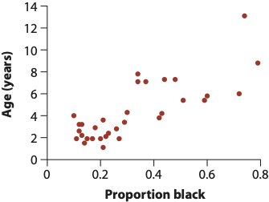

```{r setup, include=FALSE}
knitr::opts_chunk$set(echo = TRUE)
library(tidyverse)
library(modelr)
library(broom) 
library(patchwork)
```

> CAUTION: This is NOT a full-fledged statistics course. This document focuses on performing and interpretting linear regression models rather than their mathematical underpinnings. 


## Cheatsheet chunk
```{r, eval=F, error=T}
###### Building linear models with lm ######
# Single predictor
lm(Y ~ X, data = dataframe) -> lm_output

# Multiple independent predictors
lm(Y ~ X + X1 + X2, data = dataframe) -> lm_output

# Multiple predictors with an interaction effect
lm(Y ~ X*X1, data = dataframe) -> lm_output


##### Examining linear model output ######
# Standard view of fitted model
summary(lm_output) 

# Tidy views of fitted model with the broom library
broom::tidy(lm_output)   ## Coefficients
broom::glance(lm_output) ## R^2 and other _model fit_ metrics
broom::augment(lm_output) ## Get mmmooorrree information

# Extract model info with the modelr library
modelr::add_residuals(dataframe, lm_output)    # residuals for each observation
```


## What is a linear model?

In statistics and data science, we often want to describe how the value of one variable *depends on and/or can be explained/predited by* the value of one or more other variables. For example, if we know an individual's height, could we reasonably predict their body depth? Potentially - we might want to also consider a lot more information like the person's age, biological sex, health and diet, etc, in addition to just their height. The variable we are interested in predicting (here, *body depth*) is known as the **response or dependent variable**. We are interested in seeing how certain other variables can provide meaningful information about body depth, and we call these other variables **predictor or explanatory or independent variables**.

The term "linear model" implies a statistical framework for quantifying to what degree *one or more predictor variables* describes the variation seen in a *response variable*. Linear models can answer questions like...
+ Which of the predictor variables show a significant relationship with the response variable?
  + In this case, *significant* (more or less..) implies that the predictor variable's values influence, to some degree, values of the response variable. An *insignificant* (again, more or less..) predictor is one whose influence on the response is no different from random chance.
+ How does the response value change when the predictor value changes?
+ How much variation in the response variable does each predictor variable explain?


The mathematical formula, generally speaking, for the simplest linear model:

\begin{equation} 
  Y = \beta_1X_1 + \beta_0 + \epsilon
\end{equation} 


The $Y$ is our response, and all $X$ variables are our predictors - in the simple example above, there is a single predictor $X_1$. Each $\beta$ (Greek letter "beta") is a given predictor's *coefficient*, and they quantify the relationship between each predictor and the response. The $\epsilon$ (Greek letter "epsilon") represents the *error* in the model, or in other words, what percent of variation in the response variable can NOT be explained by the predictor variable(s)? In fact, the formula above is actually the formula for a line, or as you may be used to seeing it, *Y = mX + B*;  the $\beta_1$ is the slope *m*, and the $\beta_0$ is the intercept *B*. 

More generally for *N* predictors, we can write the formula as (rearranged slightly)

\begin{equation} \label{eq:full}
  Y =  \beta_0 + \beta_1X_1 + \beta_2X_2 + \beta_3X_3 ... + \beta_NX_N + \epsilon
\end{equation} 


The error term $\epsilon$ is known as the model's *residuals* - how much variation in the response is residual (left over) after considering all the predictors? It is virtually never true that the predictors will capture 100% of the variation in the response, and the uncaptured percent falls into that $\epsilon$ term. Practically, what does this mean? We can conceptualize this most easily with a simple linear regression where a *line of best fit* is **FIT** (get it? line of best FIT?) to the data. This line of best fit (namely its associated slope and intercept) IS the linear model - we will call it the regression line. 

One of the most common procedures for fitting a model is called ["Ordinary Least Squares,"](https://en.wikipedia.org/wiki/Ordinary_least_squares) which is an algorithm that finds the line which minimizes the "sum of squares" of the residuals. The residuals themselves are the *distance* between each point and the regression line, and the sum of squares in this case is, you guessed, the sum of the squared residuals. We'll call it "RSS": the **r**esidual **s**um of **s**quares. Consider this example (images from [this book](https://www.amazon.com/Analysis-Biological-Data-Michael-Whitlock/dp/1936221489)) that shows the relationship between the age of a given lion the the proportion of its nose that is black (nose color changes over time for cats and dogs! awwww):

{width=250px}

A linear model for this data would be the simple regression, $Y = \beta_1X_1 + \beta_0$ aka a line.
The computer will try to find the best combination of values for the slope ($\beta_1$) and Y-intercept ($\beta_0$) that makes the RSS as small as possible by testing out hundreds or thousands of different values. This is what we mean by **fitting a model**: What set of *parameter values* (fancy word for variables) match the data the best?

In the three images below, we see three different ways this regression line could be drawn. Each line segment from the the point to the regression line is a residual!

{width=600px}

+ "Large deviations": Very high sum of squares. This line is a poor fit to the data.
+ "Smaller deviations": A low sum of squares. The line is a better, but not best, fit to the data.
+ "Smallest deviations": This line represents the line that minimizes the residuals (which the computer found after trying hundreds or thousands of options!. Its corresponding slope and intercept are our *model parameters*. It turns out this slope is about $\beta_1 = 10.64$ and the intercept is about $\beta_0 = 0.88$. Our final fitted model would therefore be $Y = 10.64X_1 + 0.88 + \epsilon$. In the coming sections we will learn how to interpret these quantities.


## Assumption of linear regressions

In this class, we will talk about two general (NOTE: this is a pun, because actually we are talking about "generalized linear models" -  you should be aware that my language choice is actually really funny) types of linear models:

+ "Linear regression", which are used to model **NUMERIC response variables** (this document)
+ "Logistic regression", which are used to model **BINARY (categorical) response variables** (e.g., "Yes/No" categories) (a forthcoming document)

These models make several key assumptions about the underlying predictors and response variable. These assumptions represent properties in the data itself which must be satisified in order for the statistics to be reliably interpreted. Linear regressions are only valid if these assumptions are met:

+ **Numeric predictors must a linear relationship with the numeric response.** For example, in the two plots below, the LEFT shows a linear relationship: This data is suitable for analysis with a linear regression. The RIGHT shows a non-linear relationship: This data is not suitable for analysis with a regression (unless you transform) the data. 
```{r, echo=F, warning = F, message=F, fig.width = 7, fig.height=3}
tibble(y = 10:60) %>%
  mutate(x1 = y * runif(51, 1.25, 2), x2 = y**3) -> dat
ggplot(dat, aes(x = x1, y=y))  +geom_point() + geom_smooth(method = "lm", se =F, size=0.5) + ggtitle("Linear relationship") + xlab("X") + ylab("Y")-> p1
ggplot(dat, aes(x = x2, y=y))  +geom_point() + geom_smooth(method = "lm", se =F, size=0.5) + ggtitle("NOT a linear relationship")+ xlab("X") + ylab("Y")-> p2
p1 + p2
```
  
+ **Categorical predictors should have uniformly-distributed variance**. For example, in the two plots below, the LEFT shows a numeric variable whose different distributions *across the categorical variable have about the same spread* (although the means differ!): This data is suitable for analysis with a linear regression. The RIGHT shows an example where variance is NOT equally distributed, and this may not be suitable for analysis with a linear regression.
```{r, echo=F, warning = F, message=F, fig.width = 7, fig.height=3}
tibble("categorical predictor" = c(rep("category 1", 50), rep("category 2", 50), rep("category 3", 50)),
       "response values" = c(rnorm(50, 10, 2), rnorm(50, 20, 2), rnorm(50, 5, 2))) %>%
  ggplot(aes(x = `categorical predictor`, y = `response values`, color = `categorical predictor`)) +  geom_jitter(size=0.5) + theme(legend.position = "none") + ggtitle("Equal variance across groups :)") -> p1


tibble("categorical predictor" = c(rep("category 1", 50), rep("category 2", 50), rep("category 3", 50)),
       "response values" = c(rnorm(50, 10, 2), rnorm(50, 20, 7), rnorm(50, 5, 0.2))) %>%
  ggplot(aes(x = `categorical predictor`, y = `response values`, color = `categorical predictor`)) +  geom_jitter(size=0.5) + theme(legend.position = "none") + ggtitle("UNEQUAL variance across groups :(") -> p2

p1 + p2
```
  

+ **The _residuals_ of the fitted model should be normally-distributed (a bell curve).** There is another type of plot, called a "Q-Q plot" ("quantile-quantile") we will see later in this document for more carefully examining residuals.
```{r, echo=F, warning = F, message=F, fig.width = 7, fig.height=3}
tibble(x = rnorm(500)) %>%
  ggplot(aes(x = x)) +geom_density(fill = "cadetblue") + xlab("residuals") + ggtitle("Reasonably normal") -> p1
tibble(x = rexp(500)) %>%
  ggplot(aes(x = x)) +geom_density(fill = "darkorchid3") + xlab("residuals") + ggtitle("NOT normal")-> p2
p1 + p2
```
  + *A common misconception* for regression is that the data itself must be normally distributed. This is not true! It's the *error* aka residuals that must be normally distributed, which can only be examined after the model is fitted. Again, there is no assumption that numeric predictors or the response be normally distributed!!

### Analyses that are actually all linear regression models

You will often hear these fancy statistical names for different tests. Fundamentally, they are all linear regressions with different types of predictors. Really there is no need to distinguish them!! You just need to know how to interpret predictor coefficients, and you can make any model you want. Again, all linear regressions have a **numeric response**. 

+ Correlation: Read on to the the next section!!
+ Simple linear regression: Models with a single *numeric* predictor variable
+ Multiple linear regression: Models with several  *numeric* predictor variable
+ ANOVA (**An**alysis **o**f **Va**riance): Models with a single *categorical* predictor variable
+ MANOVA (**M**ultivariate **An**alysis **o**f **Va**riance): Models with a multiple *categorical* predictor variables
+ ANCOVA (**An**alysis of **Cova**riance): Models with a single *categorical* AND one or more *numeric* predictor variables
+ MANCOVA (**M**ultivariate **An**alysis of **Cova**riance): Models with multiple *categorical* AND multiple *numeric* predictor variables

In fact, so are hypothesis tests like *t*-tests and ANOVA, and similarly their non-parametric equivalents - Mann-Whitney aka Wilcoxon, sign test, and Kruskal-Wallis test. [This post](https://lindeloev.github.io/tests-as-linear/) goes into extensive depth about the how and why of this Truth.


#### Briefly, correlation

A closely related (both conceptually and mathematically) topic here is *correlation*, which is a quantity that tells us whether two variables appear to be associated, or non-independent. **Correlation does NOT IMPLY causation** - it merely implies an observable pattern of association. There are many different wants to quantify a correlation, but perhaps the most commonly-used one is Pearson correlation. This quantity measures strength and direction a of **linear** association between normally-distributed numeric variables. This is measured with the correlation coefficient *r* which can be any value in $-1 \leq r \leq 1$. Below are shown examples of data with PERFECT correlations: there is a perfect x-y association, but the directions are different. There is also an example of NO correlation.

```{r, echo=F, fig.width=6.5,fig.height=2}
tibble(x = seq(1, 100, 5), y = x*-1, y2 = runif(20, -10, 10)) -> dat

p1 <- ggplot(dat, aes(x=x,y=x)) + geom_point() + geom_abline(color="red", size=0.5) + xlab("Predictor") + ylab("Response") + ggtitle("r = 1")

p2 <- ggplot(dat, aes(x=x,y=y)) + geom_point() + geom_abline(slope = -1, color="red",size=0.5) + xlab("Predictor") + ylab("Response") + ggtitle("r = -1")

p3 <- ggplot(dat, aes(x=x, y=y2)) + geom_point() + geom_hline(yintercept=0, color="red", size=0.5) + xlab("Predictor") + ylab("Response") + ggtitle("r = 0")

p1 + p2 + p3
```


The strength of the relationship is heavily influenced by *noise* (images from [this book](https://www.amazon.com/Analysis-Biological-Data-Michael-Whitlock/dp/1936221489)). The farther points are from the middle, the more error (residuals!!) there is, and hence the lower the correlation.

{width=600px}


**But be careful!!** The computer will still calculate a correlation even if the data is not linearly related! The correlatio below is NOT VALID because the assumption of linearity has not been met. Always plot your data!!!

```{r,echo=F, fig.width=3, fig.height=2.5}
tibble(x = (1:200)/10, y = exp(x)) -> dat
ggplot(dat, aes(x=x,y=y)) + geom_point(size=0.25) + ggtitle("r = 0.52, but NOT VALID")
```

There are other types of correlations that can be employed (for example, Spearman rank correlation) when the data is not linearly related. Fundamentally, if you run a linear regression, you have implicitly run a correlation. Have some fun with correlations by [practicing guessing the value for *r*](http://guessthecorrelation.com/).

## Examples and interpretation

All examples will use the external dataset `crabs` and assume $\alpha=0.05$. This dataset contains physical measurements from 200 crabs, including their sex (M/F), color (orange or blue), and various other quantities measured in millimeters (mm). **The goal of these examples is model body depth in crabs. Therefore, the column `body_depth` is our response variable.**
```{r, collapse=T}
crabs <- read_csv("https://raw.githubusercontent.com/sjspielman/datascience_for_biologists/master/materials/lm_files/crabs.csv")
dplyr::glimpse(crabs)
```


### Simple linear regression: Single numeric predictor

Let's begin with a simple regression to examine the relationship between **carapace length** and **body depth**, specifically to what extent body depth can be explained by carapace length. Therefore, carapace length is our predictor (X) variable, and body depth is our response (Y) variable.


**The very first thing we should do is VISUALIZE our data** . Make sure that each numeric predictor (in this case there is only 1!) indeed has a roughly *linear relationship* to the response. Indeed, this relationship looks linear, and apparantly (quite strongly!) positively related, so we are good to go.

```{r, fig.width = 4, fig.height = 3}
# predictor goes on X, response goes on Y
ggplot(crabs, aes(x = carapace_length, y = body_depth)) + 
  geom_point()
```


We perform regressions using the function `lm()` (any guesses what this stands for?).

```{r}
## perform linear regression and save as model_fit
## Y ~ X !!!!!!!!!!!!!! 
## RESPONSE ~ PREDICTOR !!!!!!!!!!!!!!!!
model_fit <- lm(body_depth ~ carapace_length, data = crabs)

## view output with summary(). Ugly, useful for getting a visual overview.
summary(model_fit)
```


### Interpreting the model
Let's go line-by-line through the output:

**Call** simply reminds us of the linear model formula we specified when using `lm()`

**Residuals** shows the *five-number summary* of the residuals 

**Coefficients** tell us our $\beta$ values. Their *Estimate* is the value the model returned, Their *Std. Error* indicates how close/far these model estimates, derived from the sample, likely are from the "true" population values. The *t value* is *t* statistic associated with the estimate's significance, and the final column *Pr(>|t|)* is the P-value associated with the *t* statistic - it tells us if the coefficient is significant or not.

**(Intercept)** is our fitted value for $\beta_0$. It tells us: What is the EXPECTED VALUE of the response variable when the numeric predictor value is 0? In this case, what do we expect the average body depth will be when a crab's carapace length is 0 mm? Here, we expect that crabs will have a body depth of -1.155 mm, on average, when their carapace length is 0. We can also write this as $-1.155\pm0.205$ to acknowledge the standard error! This is of course NOT realistic and illustrates perfectly that you need to be careful to interpret coefficients with biological intuition! Just because the computer spits out a number doesn't mean it's meaningful. No crabs will have a body depth of 0mm. Regardless, this quantity needs to be here to fulfill the mathematical model itself - we're just smart enough to know that the mathematical model is terrible at biology.

  + **Intercept significance**: The P-value for the intercept is derived from a standard null hypothesis: "The intercept = 0." Significant P-values can be interpreted to mean that it is unlikely the true intercept is 0 (but caution, this is NOT exactly what P-values mean). In this case, the intercept is highly significant (*P=6.09e-08*). Therefore, there is evidence the intercept differs from 0.
    
**carapace_length** is our fitted value for $\beta_1$. It tells us: What is the EXPECTED change of the response the predictor increases by a unit of 1? In this case, by how much do we expect body depth will increase/decrease when the carapace length goes up by 1? Here, we expect for every 1 mm increase in carapace length, body  depth will *increases* by 0.473 (or, $0.473\pm0.00624$). Remember in this case, this value is the slope! 

  + **Coefficient significance**: The P-value for any numeric intercept is derived from a standard null hypothesis: "The coefficient = 0." Significant P-values can be interpreted to mean that it is unlikely the true coefficient is 0 (but caution, this is NOT exactly what P-values mean). The P-value here is highly significant at *P<2.2e-16* (this is R's lower bound for reporting tiny P-values), so we quite confident that the true value indeed differs from 0.

**Residual standard error**: The standard error associated with residuals. Don't worry much about this line.

 **Multiple R-squared** and	**Adjusted R-squared** give the $R^2$ associated with the model!! **A model's $R^2$ tells you the percent of variation in the response that can be explained by the predictors**. This is SUPER important (and note, it is actually the squared Pearson correlation coefficient!). The "Adjusted R-squares" is somewhat more reliable for consideration - it corrects for any overfitting artifacts inherent in modeling, so focus on this value. It's associated P-value is on the next line (here, *P<2.2e-16*), and the associated null hypothesis for this P-value is $R^2 = 0$. **In this model, 96.65% of the variation in body depth can be explained by carapace lengths. 3.35% of the varation in body depth is therefore UNEXPLAINED by our model.** That 3.35% is sneakily hidden in the *\epsilon* term of the linear model equation. This is _a really really good model_. 
  

#### Conclusions:

+ Our fitted model is $Y = 0.473X - 1.16$
+ ~96.65% of variation in crab body depth can be explained by carapace length. 
+ For every 1 mm increase in carapace length, we expect body depth to increase, on average, by 0.473 mm.

### Visualizing the model

We can visualize this output with a scatterplot and `geom_smooth()`! This is why we've been saying `method = "lm"` in `geom_smooth()` - this function adds a trendline, and by specify "lm" we are telling `geom_smooth()` to use a linear model to determine the trendline:
```{r, fig.width = 6, fig.height = 4}
# predictor goes on X, response goes on Y
ggplot(crabs, aes(x = carapace_length, y = body_depth)) + 
  geom_point(size = 0.5) +        ## making the points small to help see the regression line
  geom_smooth(method = "lm",     ## make a trendline using "lm"
              color = "navy",    ## make the trendline goldenrod
              size = 0.5,        ## make the line small to help see the confidence interval for TUTORIAL REASONS
              fill = "deeppink4") + ## fill for the confidence interval
  labs(x = "Carapace length (mm)", 
       y = "Body depth (mm)", 
       title = "Linear regression to predict crab body depth") + 
  annotate("text",                ## geom to annotate with is text annotation
           x = 20, y = 30,         ## coordinates of the label, decided after trying several places..
           label = "R^2 == 0.966", ## label itself, double equals is needed for use with parse=T
           parse=T,               ## makes label actually show as a formula, with squared as superscript!
           color = "firebrick", size = 5)  + ## font color and size 
  theme_bw()
```


**Critical followup: What is a confidence interval?** A confidence interval (CI) is meant to help convey *error* in the estimate - in this case, the confidence bands you see (pink area around the line) represents the error associated with our fitted slope aka our model's $\beta_1$ estimate! It is directly related to "standard error", so in the function `geom_smooth()` you can turn it off as `geom_smooth(lm=F)` to not display it.

Loosely speaking, a *95% CI* (ggplot and many others use 95% confidence interval by default) means: Assuming all the lovely assumptions of our statistical framework, there is 95% probability that the TRUE VALUE OF THE SLOPE is within the CI. Stated more accurately, if you took N random samples of crabs and calculated their regressions of body depth across carapace length, line (slope and intercept!) would fall within the 95% shaded area CI for 95% of the samples. Critically, the 95% CI does not mean that there is a 95% chance the true line is in the CI. It means 95% of the time we try to find the true line, our findings will fall in this area. 

**For an excellent intuitive understanding of what this means, see [the second plot example in this package's README](https://github.com/wilkelab/ungeviz).**

### Checking the assumption of normal residuals

One of the assumptions of linear regressions is that residuals should be normally distributed. Residuals are calculated as part of the model itself, so the goal is to check the residuals AFTER you perform the model to see if it worked out ok. If the residuals are severely not normal, it means there were some problems with the model itself and you need to rethink your approach - which predictors to include/exclude? add in interaction effect [keep reading!!]? transform some of the data?

We can check this assumption using a **Q-Q plot**, specifically a NORMAL QQ plot which shows the relationship between your data and a *theoretical prediction* for what the data would like if it were normally distributed. If the data falls roughly in a straight line, the data is distributed normally!!! If not, not normal :( 

First, we need to get the residuals themselves out of the model - my preferred way for doing this uses the `broom()` package. This packages tidies (sweeps up?...sigh.) model output into nice little tibbles, and it has three main functions we want: `broom::tidy()`, `broom::glance()`, and `broom::augment()`. The first two are nice for collecting the ugly summary data into tibbles. We simply pass in the model output itself.

```{r}
# redefining model just to orient you back
model_fit <- lm(body_depth ~ carapace_length, data = crabs)

# assumes broom library is loaded! 
# it comes installed with tidyverse, but needs to be loaded with library(broom) in the setup chunk.
# Gives coefficients in tidy form
broom::tidy(model_fit)

# Gives R^2 (and some other values, stay tuned!!!) in tidy form
broom::glance(model_fit)

## Gives a whoooole bunch of under-the-hood info in tidy form - tacked onto the data itself!!!
broom::augment(model_fit)
```


Focusing on the `augment()` output, we see there are 136 rows - indeed there are 136 crabs!! Each row represents an outcome from the model. The particular columns we may want are `.fitted` and `.resid`:

+ `.fitted`: What does the model formula give for the response at this predictor? For example, row 1 is an observation with carapace length of 16.1 mm and body depth of 7 mm. If I put the *predictor* 16.1 into the model *$Y = 0.473X - 1.16$*, I'd get: $(0.473\times16.1) - 1.16 = 6.46$!! We won't use this quantity now, but it's really nice to know about.
+ `.resid`: The residual associated with that row - this column contains our residuals!!!

For making QQ plots, we'll use the base R functions `qqnorm()` (for a **norm**al distribution QQ plot) and `qqline()` (in this case base R is a lot easier than ggplot2). They are run as *separate commands entirely*, but R will always assume `qqline()` should go on top of the *most recently run QQ plot*:

```{r}
## plot
broom::augment(model_fit) -> augmented_fit

# plot the .resid column (yes it starts with a period), and add a line for visual guidance. 
qqnorm(augmented_fit$.resid)
qqline(augmented_fit$.resid, col = "red")  #Spielman personal preference, I like making it a color. base R uses "col"
```

This is pretty good, but could be better - the tails of the plot, in particular the right, have a bit of deviation, but not so much that I'd worry. So, I'm satisified with the assumptions being met for this model.

*Here are examples of how the plot might look when it's time to start worrying:*
```{r, echo=F, fig.height=4, fig.width=10}

par(mfrow=c(1,3))
x <- log(1:50)
qqnorm(x)
qqline(x)
x <- c(rnorm(100, 10, 1), rnorm(20, 5, 1), rnorm(20, 15, 1))
qqnorm(x)
qqline(x)
x <- (1:50)**3
qqnorm(x)
qqline(x)
```

**Notably** there is another neat way to get the residuals using the package `modelr` (within `tidyverse`, but needs to be loaded). We will use several more functions from this VERY helpful (but caution, often times very advanced) package soon!. The function `add_residuals()` can be used this way:

```{r}
## first argument is the data itself, second is the model object
## output column `resid` contains the goods
modelr::add_residuals(crabs, model_fit)
```


### Simple ANOVA: Single categorical predictor

What if, rather than a numeric predictor (carapace Length), we had a *categorical* predictor, say sex? Here we might ask: **Does sex predict body depth in crabs**? In the context of running an explicit ANOVA, one might phrase it as: **Does the variation in body depth differ across sex in crabs?** They are in fact the same question!

Again, begin with a quick-and-dirty visualization. Here we'd like to see that the distribution of carapace widths has similar *spread* between ages (assumption of equal variance for categorical predictors!). Indeed, these two distributions show similar amounts of spread (how much relative space along the Y axis they take up), so assumption is met.

```{r, fig.width = 4, fig.height = 3}
ggplot(crabs, aes(x = sex, y = body_depth, color=sex)) + geom_jitter()
```


Let's run the model:
```{r}
## perform linear model and save as model_fit
model_fit <- lm(body_depth ~ sex, data = crabs)

## view output with summary(). 
summary(model_fit)
```


**This is where the order of categorical variables become really important**: All linear model output when categorical predictors are used assumes a given level of the categorical variable. Unless you re-factor a variable explicitly, levels will be used in alphabetical order - here, "F" comes before "M". 

Coefficients associated with categorical predictors have a somewhat different interpretation 

We see the intercept is highly significant (*P<2e-16*) with a value of 13.724. **Intercepts for a model with a categorical predictor mean: What is the expected body depth of the baseline level, which in this case is "F" (female)?**. We expect the average female crab to have a body depth of 13.72 mm. This is the "categorical" analogy of a standard intercept that would be interpreted as, "what is body depth when sex is 0?". Of course, as a categorical variable, sex cannot be 0 - it's F or M in this dataset. 

The coefficient associated with SexM means, **How does being male influence body depth relative to the factor baseline, female?** On average, males have body depth 0.613 mm larger than females. (Notably, for a categorical variable with *N* levels, there will be see *N-1* coefficients). In this case, however, the P-value is NOT significant (P=0.206). Similarly our adjusted *R^2* is not significant. Therefore, we actually do not see evidence that the average male body depth differs from the average female body depth.

**This model therefore tells us: sex is NOT explanatory of body depth in crabs!** Either way, let's think how we might visualize the model results. The strip plot used above to check assumptions is a pretty good way to do it, or any other way to show distributions. That said, these models operate on _means_, so it might be useful to actually visualize the means specifically. A neat trick for doing this comes from `stat_summary()`!!

```{r, fig.width = 6, fig.height = 4}
ggplot(crabs, aes(x = sex, y = body_depth, color = sex)) + 
  geom_jitter() + 
  labs(x = "Sex", y = "Body depth (mm)") +
  theme(legend.position = "none") +
  stat_summary(fun.data = "mean_se", # calculate mean and se
               color = "black") 
```

As you can see, those means look about identical and their standard errors overlap - it makes sense that the model did *not* show evidence that sex is predictive of body depth.

#### As an ANOVA

For posterity, it can't hurt to see how this looks as a bonafide ANOVA table using the function `aov()`:

```{r}
aov(model_fit) -> anova_model_fit
summary(anova_model_fit)
```

### LM with numeric and categorical predictors

Let's see how to run and interpret a model with BOTH numeric and categorical predictors. We will examine how color and carapace length together might be predictive of body depth in crabs. Said otherwise: We've seen how carapace length influences body depth. Does this effect persist when controlling for color? Importantly, when you have multiple predictors, the model assumes they are FULLY INDEPENDENT and ENTIRELY UNRELATED. Of course this is not always true - read on to learn more about how to deal with this issue!

Let's run the model with multiple predictors, which we simply add together in the formula
```{r, collapse=T}
## order of predictors does NOT matter
model_fit <- lm(body_depth ~ color + carapace_length, data = crabs)

## view output with summary(). 
summary(model_fit)
```

When considering BOTH sex and carapace Length, we find:

+ The intercept means your average blue (the baseline level of `color`) crab _with a carapace length of 0_ has a body depth of -0.997 mm. It's highly sigificant but unrealistic - moving on.
+ The "colororange" means *when controlling for carapace length*, your average orange crab's body depth will be ~1.045 mm larger than an average crab. Again, highly significant.
+ The "carapace_length" coefficient means *when controlling for color*, the average crab's body depth increases by 0.452 per 1 mm increase in carapace length, and it's highly significant.
+ The predictors explain *~98.8%* of the variation in body depth - our model appears to have improved in predictive ability by jointly considering color with carapace length! A mere 1.2% of variation in body depth is unexplained by the two significant predictors.

**How can we visualize this model?** We can again make a scatterplot, and show the trend lines for each sex:

```{r, fig.width = 6, fig.height = 4}
ggplot(crabs, aes(x = carapace_length, y = body_depth, color = color)) + 
  geom_point() + 
  labs(x = "Carapace length (mm)",
       y = "Body Depth (mm)",
       color = "Crab color") + 
  scale_color_manual(values = c("blue", "orange")) + # why not!
  geom_smooth(method = "lm") +
  annotate("text", x = 20, y = 30, label = "R^2 == 0.988", parse=T, size=5)
```


### LM with multiple numeric predictors

Now we will look at a model with multiple numeric predictors, carapace width *and* carapace length. We know already that carapace length has a linear relationship with body depth from earlier in this document, so let's just check out the linearity of body depth/carapace width. Indeed, the relationship is linear, so let's proceed.

```{r, fig.width = 3, fig.height = 3}
ggplot(crabs, aes(x = carapace_width, y = body_depth)) + geom_point()
```

Again, we can simply add predictors together (order does not matter!):
```{r}
## perform linear model and save as model_fit
model_fit <- lm(body_depth ~ carapace_width + carapace_length, data = crabs)

## view output with summary(). 
summary(model_fit)
```

Our model has found:

+ You average crab with carapace width and carapace length both equal to zero will have, on average, a body depth of -0.65, and this is highly significant at *P=0.000252*. But of course, this is not biologically meaningful - it just is needed to build the model.
+ On average, we expect that body depth *decreases* by ~0.46 when carapace width increases by 1 mm. This is also highly significant.
+ On average, we expect that body depth *increases* by ~0.979 when carapace length increases 1 mm. This is also highly significant.
+ The independent effects of carapace length and width explain roughly 97.76% of variation in body depth, and it is highly significant.

We could visualize this if we want by putting on predictor on the X, and using color to disinguish the other predictor. That said, it is very difficult to make scatterplot visualizations with multiple numeric predictors, especially since we can't draw two trend lines in one set of axes.

```{r, fig.width = 6, fig.height = 4}
ggplot(crabs, aes(x = carapace_length, y = body_depth, color = carapace_width)) + 
  geom_point(size = 2.5) + # i like the plot with bigger points 
  labs(x = "Carapace length (mm)", 
       y = "Body depth (mm)",
       color = "Carapace width (mm)") +
  scale_color_distiller(palette = "Reds") +
  annotate("text", x = 20, y = 30, label = "R^2 == 0.977", parse=T, size=5) + 
  theme(legend.position = "bottom") # again my personal preference
```


### LM with interaction effects

So far, we have fit TWO models that have multiple predictors: 1) using color and carapace length, and 2) using carapace width and carapace length. Both models made the assumption that all predictors are independent of one another, e.g. carapace width and length are independent (in statistical terms, we'd say those models used "additive effects"). Of course, this is unlikely to be the case. In addition, it is possible that the effects of carapace length on body depth *depend* on carapace width, and vice versa. We would call this an **interaction effect.** 

As a general rule, when you have multiple predictors for a linear model, it is usually a good idea to FIRST run the model assuming an interaction effect. If the interaction effect is not significant, use an additive model instead. If the interaction effect IS significant, *ignore* the additive effects and report only on the interaction effects. Indeed, if there is a significant interaction, it no longer makes sense to focus on individual contributions.


#### Example #1

Previously, we looked at the explanatory power of carapace length and  color on body depth as independent effects. What if they are not independent, however? Looking at the visualization we made from this model, we see that the two regression lines for each crab color are roughly parallel - this suggests that the relationship between carapace length and body depth is consistent regardless of color. This would mean NO interaction effect, but we can formally test this out by adding an interaction term to the model:


```{r}
# interact by using * instead of + for predictors
model_fit <- lm(body_depth ~ carapace_length * color, data = crabs)
summary(model_fit)
```

In this output...

+ **carapace_length** is the *independent* coefficient for carapace_length
+ **colororange** is the *independent* coefficient for color
+ **carapace_length:colororange** is the *interaction effect* coefficient for caparace length x color, and it is in fact significant at *P=0.00394*!! Indeed, there **is** a significant difference in trend between crab colors. However it's quite hard to see in the plot - this is a great example of when statistical significance corresponds to only moderate, in this case, small, effect size. 

Upon finding a significant interaction effect, we promptly *ignore* any independent effects - since the interaction tells us these variables are not independent, it does not make sense to consider their independent influence on body depth. We have evidence that the way that carapace length affects body depth depends on color! Similarly, the way that color affects body depth depends on carapace length. 

The best way to interpret this model is not to focus on the interaction term coefficient (they're a little tricky..), but rather to make a plot like we did earlier with the two slopes, and see how those slopes potentially cross or interact, or in this case are only barely non-parallel.

NOTE: It is possible to directly specify the interaction effect to the linear model like so - in fact the interaction effect is a *third term* in the model:
```{r}
model_fit <- lm(body_depth ~ carapace_length + color + carapace_length:color, data = crabs)
summary(model_fit)
```
#### Example #2

Let's do another interaction model  by considering two *categorical predictors*, sex and color. This can be visualized with an *interaction plot* which explictly show how the *mean response* (here, mean body depth) depends on levels of two categorical predictor: 

```{r, fig.width=4.5, fig.height=4}
crabs %>%
  ## get mean body depth per group first
  group_by(sex, color) %>% 
  summarize(mean_body_depth = mean(body_depth)) %>%
  ggplot(aes(x = sex, y = mean_body_depth, color = color)) + 
    geom_point() + 
    geom_path(aes(group = color)) +
    scale_color_manual(values=c("blue","orange"))
```

This plot suggests potential interaction effect! It seems female orange crabs have higher mean body depths compared to male orange crabs, but the opposite appears true blue. Notably, you see the *slopes of these lines do not match.* (Lines have the same slope - the effect of sex does NOT appear to depend on Color.) A linear model will tell us if this potential interaction is significant - but note the tiny tiny breaks on the Y-axis? If there is a significant interation, it will likely have a very small effect size.

Let's go ahead and see:
```{r}
# interact by using * instead of + for predictors
model_fit <- lm(body_depth ~ sex * color, data = crabs)
summary(model_fit)
```

In this output...

+ **sexM** is the *independent* coefficient for sex
+ **colororange** is the *independent* coefficient for color
+ **sexM:colororange** is the *interaction effect* coefficient for sex x color, and it is moderately significant at *P=0.0355*.

Upon finding a significant interaction effect, we promptly *ignore* any independent effects - since the interaction tells us these variables are not independent, it does not make sense to consider their independent influence on body depth. We have evidence that the way that color affects body depth depends on sex! Similarly, the way that sex affects body depth depends on color. 

The best way to interpret this model is to a) identify if an interaction is significant, and b) compare the means with an interaction plot. We've basically done all those steps, so we are set!

