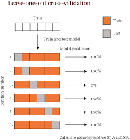
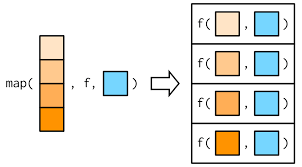

```{css, echo=F}
@media print {
  .has-continuation {
    display: block !important;
  }
}

pre {
  white-space: pre-wrap;
  
}

ul:first-child, ol:first-child {
    margin: 0;
}


.remark-code, .remark-inline-code { 
    color: #326369;
    font-weight: 600;
}
/* Code block code */
.hljs .remark-code-line { 
  font-weight: normal;
  font-size: 15px;
}

.pull-left2{
  float: left;
  width: 35%;
}

.pull-right2{
  float: right;
  width: 55%;
}
```

```{r setup, include=FALSE}
knitr::opts_chunk$set(echo = TRUE, collapse=TRUE)
library(tidyverse)
library(modelr)
library(broom)
library(xaringan)
library(patchwork)
theme_set(theme_bw())
```


## Model evaluation and prediction

+ $R^2$ tells how how much variation is explained **in the data the model was FIT ON**
  + fit on <===> "trained on"
  

+ How good is the model at explaining variation **in data it does NOT know about?**
  + Should we even bother using our model to predict future outcomes?

---

## More measures of model evaluation

+ RMSE ("Root mean squared error") and MAE ("Mean absolute error")
  + Easily interpreted in units of "Y"
  + RMSE is very common! "Average" error we can expect when using this model
+ Less easily interpreted, but also commonly-used evaluation measurements
  + MSE = mean squared error
  
---

## `modelr` makes life easy!!

```{r}
# use trace = F to suppress excessive output which hurts my eyeballs
fit <- step( lm(Sepal.Length ~ ., data = iris), trace = F  )
broom::tidy(fit)
broom::glance(fit)
```

--

```{r}
## Obtain R^2 quickly with modelr
modelr::rsquare(fit, iris) #<<

## Obtain RMSE quickly with modelr
modelr::rmse(fit, iris) #<<
``` 

---

## Use that model going forward easily

```{r}
## reminding you of the fit variable:
fit <- step( lm(Sepal.Length ~ ., data = iris), trace = F  )


## Extract the FORMULA as fit$formula
lm(fit$formula, data = iris)
```

---

## Validation with testing/training

+ Randomly **split** your dataset into two parts:
  + The "training" part (usually 60-80% of the data) **builds** aka **trains** the model
  + The "testing" part (the remaining 20-40%) evaluates aka **tests** the performance of the model
  + If model performs terribly on testing data, suggests model was *overfit*
  + Either way, performance is usually better on training data. **Why?**

---

## Cross validation with a training and testing split

```{r}
# Use dplyr::sample_frac() to randomly sample a fraction of rows
training_iris <- sample_frac(iris, 0.7) ## 70% into training
nrow(training_iris)
```
--

```{r}
# Get the "anti training" for testing.. with anti_join()!
# In anti_join(), the FULL data goes FIRST!!
testing_iris <- anti_join(iris, training_iris) ## remaining 30% into training
nrow(testing_iris)
```
--

```{r}
## TRAIN the model on training data: data = training_iris !!
trained_model <- lm(fit$formula, data = training_iris)
```
+ We should **NOT** use `step()` here. WHY?????

---

## Compare training metrics to those on TESTING data

```{r}
## How does the model do on data it was TRAINED ON?
modelr::rsquare(trained_model, training_iris)
modelr::rmse(trained_model, training_iris)
```

--

```{r}
## How does the model do on data it has NEVER SEEN? The testing data!!
modelr::rsquare(trained_model, testing_iris)
modelr::rmse(trained_model, testing_iris)
```

---

## K-fold cross validation

+ Randomly divide the whole dataset into "K" equal chunks aka folds
+ Perform K iterations of model training and testing
  + "Hold back" data each time for testing!
+ Get RMSE and $R^2$ for each iteration, and look at full distribution


---

## More robust: Leave-one-out cross validation (LOOCV)

+ K-folds on speed: each "test" size is N=1!!
+ For small datasets, LOOCV probably "better"



---

## Running a K-fold CV to evaluate a model that predict Sepal Lengths

```{r}
# decide your K!
folds <- 10

# Use the amazzzzing function modelr::crossv_kfold()
crossv_kfold(iris, folds) #<<
```

---

## A necessary detour: functional programming with `purrr`

```{r}
## log of a number
log(5)

## log of an array of numbers
log(1:4)
```

--
.pull-left2[

]


```{r}
## using purrr::map returns a !!!LIST!!!
purrr::map( 1:4, log ) #<<
```

---

## map_TYPE to specify a different type of output

```{r}
## purrr, I'd really like an array of *doubles* to come out of this
purrr::map_dbl(1:4, log) #<<
```

--

```{r}
## map2 means there are TWO inputs
## recall: log has a second optional argument for BASE! The output is log base 2
purrr::map2_dbl(1:4, 2, log) #<<
```

---

## A second necessary detour: writing our own functions

```{r}
add_two_numbers <- function(a, b) 
{                                 
  a + b                           
}                                


add_two_numbers(10, 12)
add_two_numbers(5, -5)
```

---

## Back to K-fold

```{r}
crossv_kfold(iris, folds) -> iris_kfold
iris_kfold
```

---

## Using `purrr::map` to run a model at each row

```{r}
## DEFINE THE FUNCTION!! IT'S JUST THE MODEL!!!
## THIS IS IMPORTANT: As written ASSUMES (!!!!!!) fir$formula was defined in code ABOVE this function
my_iris_model <- function(input_data){
  lm(fit$formula, data = input_data)
}

iris_kfold %>%
  mutate( model_fit = purrr::map( train, my_iris_model ) ) #<<
```

---

## Using `purrr:map2_dbl` to get our metrics

+ Recall: `modelr::rmse(MODEL, DATA)`
+ Recall: `modelr::rsquare(MODEL, DATA)`

```{r}
iris_kfold %>%
  mutate( model_fit = purrr::map( train, my_iris_model ) ) %>%
  mutate( test_rmse = purrr::map2_dbl(model_fit, test, rmse),  #<<
          test_rsq  = purrr::map2_dbl(model_fit, test, rsquare)) #<<
```

---

## Putting it all together: model selection and k-fold CV

```{r}
# Initial model selection (with ENTIRE data set) to determine predictors
fit <- step(lm(Sepal.Length ~ ., data = iris), trace =  F)

# Function for use in cross-validation
my_iris_model <- function(input_data){
  lm(fit$formula, data = input_data)
}

# Validate your model
folds <- 10
crossv_kfold(iris, folds) %>%
  mutate( model_fit = purrr::map(train, my_iris_model),
          test_rmse = purrr::map2_dbl(model_fit, test, rmse),  
          test_rsq  = purrr::map2_dbl(model_fit, test, rsquare)) -> result_kfold
```


---

## Summarizing our results
```{r}
result_kfold %>%
  summarize(mean_rmse = mean(test_rmse),
            mean_rsq  = mean(test_rsq))
```

+ We expect, when used on data the model has never seen, it will predict $R^2$ of variation in sepal lengths 
+ We expect, when used on data the model has never seen, the model predictions will be roughly *RMSE* units off (the average residual is the RMSE value)
--
  ```{r}
  summary(iris$Sepal.Length)
  ```
---

## Visualizing our evaluation

+ Any kind of standard continuous distribution plot will do here:

```{r, fig.width = 8, fig.height = 4}
result_kfold %>%
  ggplot(aes(x = "", y = test_rmse)) + geom_boxplot() + 
  xlab("") + ylab("Mean RMSE")-> rmse_box

result_kfold %>%
  ggplot(aes(x = "", y = test_rsq)) + geom_boxplot() + 
  xlab("") + ylab("Mean R^2") -> rsq_box

## using patchwork:
rmse_box + rsq_box
```

---

## How to do LOOCV?

+ Same exact way except use `modelr::crossv_loo()`
  + BUT I think there's a bug in `rsquare()` when used on LOO output, so let's just do RMSE.

```{r}
# Reminding you of this function, but you only need to define it once
my_iris_model <- function(input_data){
  lm(fit$formula, data = input_data)
}


crossv_loo(iris) %>% #<<
  mutate( model_fit = purrr::map( train, my_iris_model ),
          test_rmse = purrr::map2_dbl(model_fit, test, rmse)) -> result_iris_loo

# Summary
result_iris_loo %>%
  summarize(mean_rmse = mean(test_rmse))
```

---

## Making predictions!

Once we have our model, we can predict future outcomes. **Remember: Model evaluation is NOT the same as model fitting.**

```{r}
# reminder for what our model predictors are
broom::tidy(fit) 
```

---

## Making predictions!

+ Predict using a tibble with columns **EXACTLY NAMED** as model predictor variables in the model formula
```{r}
## Oh look a new observation where we measured PREDICTORS
new_iris <- tibble(Sepal.Width  = 4.1, 
                   Petal.Length = 3.7, 
                   Petal.Width  = 1.1, 
                   Species      = "virginica")

# arguments in order: NEWDATA, MODEL
modelr::add_predictions(new_iris, fit)

# or, base R with OPPOSITE arguments. womp.
predict(fit, new_iris)
```


BONUS Q: Why did the `modelr` authors flip these arguments?


