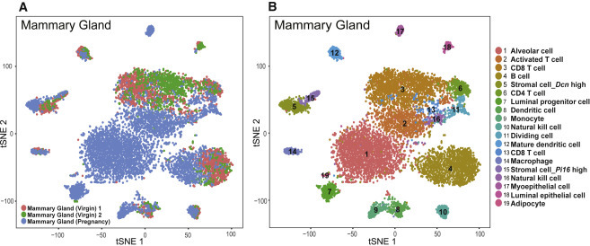
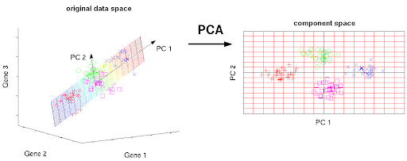

```{css, echo=F}

@media print {
  .has-continuation {
    display: block !important;
  }
}


pre {
  white-space: pre-wrap;
  
}

ul:first-child, ol:first-child {
    margin: 0;
}


.remark-code, .remark-inline-code { 
    color: #326369;
    font-weight: 600;
}
/* Code block code */
.hljs .remark-code-line { 
  font-weight: normal;
  font-size: 15px;
}

.pull-left2{
  float: left;
  width: 85%;
}

.pull-right2{
  float: right;
  width: 30%;
}
```

```{r setup, include=FALSE}
knitr::opts_chunk$set(echo = TRUE, collapse=TRUE)
library(tidyverse)
library(patchwork)
library(xaringan)
theme_set(theme_bw())
```


## Imagine: You have 500 columns in your data. How do you...

+ Visualize 500 columns?
+ Determine which 500 columns contribute variation? (without variation, there is nothing to study)

--

#### Solution: *Reduce your dimensions!* 500 is just too many! Can we boil it down to a few *representative* columns?
  + Principle components analysis (PCA)
  + Linear discriminant analysis (LDA)
  + uMAP or tSNE are commonly used for **visualization** in genomics
      + uMAP: "uniform manifold approximation and projection" 
      + tSNE: "t-distributed stochastic neighbor embedding"


---

## tSNE for funsies: The "Mouse Cell Atlas" from scRNA-seq

```{r out.width = '800px', echo=F}

```


Source: [https://doi.org/10.1016/j.cell.2018.02.001](https://doi.org/10.1016/j.cell.2018.02.001)

---

## Principle Components Analysis (PCA)


+ A linear algebra technique to emphasize *axes of variation* the data.
+ Principle component (PC) = a new *axis* constructed from the covariance matrix of the data
  + [https://towardsdatascience.com/pca-eigenvectors-and-eigenvalues-1f968bc6777a](https://towardsdatascience.com/pca-eigenvectors-and-eigenvalues-1f968bc6777a)
+ *Not* a stochastic method - it is *deterministic* (same result every time)


```{r out.width = '600px', echo=F}
knitr::include_graphics("pca_example.png")
```


---

```{r out.width = '1000px', echo=F}

```

---

## Conducting a PCA

```{r, message=F}
## just making the URL fit..
wine_url <- paste0("https://raw.githubusercontent.com/sjspielman/",
                   "datascience_for_biologists/master/data/wine.csv")
wine <- read_csv(wine_url)
dplyr::glimpse(wine)
```

---

## Conducting a PCA

1. Remove categorical columns
2. Scale all numeric columns to be centered at 0 with `scale()`. **Converts to a matrix**
3. PCA it up with `prcomp()`

--

```{r}
wine %>%
  select(-Cultivar) %>%
  scale() -> scaled_wine

# Demonstrating how scale() works first, and a lesson on "what is 0"?
head(scaled_wine, 3)
mean(scaled_wine[,1]) ## Mean of the first column in the matrix
mean(scaled_wine[,4]) ## Mean of the fourth column in the matrix
```

---

## Conducting a PCA

```{r}
# And here it is in full!!
wine %>%
  select(-Cultivar) %>% 
  scale() %>% 
  prcomp() -> wine_pca

```
  
---

## PCA output: The principle components (PCs)

```{r}
wine_pca$x %>% as_tibble() -> wine_pca_components
wine_pca_components
```

```{r}
nrow(wine_pca_components)
nrow(wine %>% select(-Cultivar))
ncol(wine_pca_components)
ncol(wine %>% select(-Cultivar))
```

---

## PCA output: The *loadings*

+ The percent of variation in each variable explained by the given PC.
+ How much does each variable in the data *load* on each PC? Range [-1,1]
  + NOT Pearson's correlation coefficient but similar in spirit
  + Sign indicates direction of the relationship

```{r}
wine_pca$rotation 
```

---

## Clean up the loadings

```{r}
# Into a usable format
wine_pca$rotation %>% 
  as.data.frame() %>% 
  rownames_to_column("quantity") %>%  
  as_tibble() -> wine_pca_loadings

wine_pca_loadings %>% head()
```

+ `TotalPhenol` and `Flavanoids` load most strongly on PC1
+ `Color` and `Ash` load most weakly on PC1

---

## Standard deviation of components

```{r}
wine_pca$sdev

# Convert to variance and normalize
wine_pca_variance <- wine_pca$sdev**2
wine_pca_variance / sum(wine_pca_variance) -> variation_explained
variation_explained
```

--

+ PC1 explains ~33.6% of variation in the whole wine data set
+ PC2 explains ~24.6% of variation in the whole wine data set
+ **By definition, PC1 = explains most variation. PC2 = second most variation. etc.**

---

## Visualizing the PCA

```{r}
## The PCs themselves
wine_pca_components %>% head(3)

## how much do original variables LOAD on PCs
wine_pca_loadings %>% head(3)

## what percent of variation is in each PC
variation_explained
```

---

## The main plot we all want to make

+ PC1 *dicriminates* all three Cultivars
+ PC2 *discriminates* Cultivar B from A, C. It does not discriminate A and C.

```{r, fig.width = 6, fig.height=3.5}
wine_pca_components %>%
  # Bring the original variables back in #<< 
  bind_cols(wine) %>% #<< 
  ggplot(aes(x = PC1, y = PC2, color = Cultivar)) + 
    geom_point() + 
    stat_ellipse() + 
    labs(x = "PC1 (33.6% variation)", 
         y = "PC2 (24.6% variation)") 
```


---

## Visualize and interpret the loadings

```{r, fig.width = 4, fig.height=4}
# uses library grid (gets loaded with ggplot2, NOT part of tidyverse!)
my_arrow <- grid::arrow(length = unit(0.05, "inches"), type = "closed")

ggplot(wine_pca_loadings, aes(x = PC1, y = PC2)) + 
  geom_segment(x = 0, y = 0,  
               arrow = my_arrow, #<<
                aes(xend = PC1, yend = PC2))  +        
  geom_text(aes(label = quantity),   
            size=3, color = "hotpink") +   ## size trial and error
  xlim(c(-1,1)) + ylim(c(-1,1)) ## fixed axis along limits of loadings
```

---

## Variation explained by each PC

```{r, fig.width = 5, fig.height=5}
tibble(variation_explained) %>%
  mutate(PC = paste0("PC", 1:8))
```

---

```{r, fig.width = 6, fig.height=6}
tibble(variation_explained) %>%
  mutate(PC = paste0("PC", 1:8)) %>%
  ggplot(aes(x = PC, y = variation_explained)) + 
    geom_col(color = "indianred2", fill = "khaki") + ## ISOLATION BRAIN COLORS
    geom_text(aes(x = PC, 
                  y = variation_explained + 0.01,  ## trial and error 
                  label = round(variation_explained,2))) +
    xlab("Principle Components") + ylab("Percent of variation in data explained") 
```

---

## Not uncommon to cluster the PCs

```{r}
set.seed(1011) #<<

wine_pca_components %>% head(2)

k <- 3 ## ehhhh why not......
wine_pca_components %>%
  kmeans(k) -> wine_pca_kmeans


## Add the clusters into the PCA data
wine_pca_components %>%
  mutate(cluster = factor(wine_pca_kmeans$cluster),## factor()!!!!!!!!!
         Cultivar = wine$Cultivar) -> wine_pca_kmeans_data
```

---


```{r, fig.width = 10, fig.height = 4}

wine_pca_kmeans_data %>%
  ggplot(aes(x = PC1, y = PC2, color = cluster)) + 
    geom_point() + stat_ellipse() + scale_color_brewer(palette = "Set1") + 
    ggtitle("UNKNOWN clusters") -> p1

wine_pca_kmeans_data %>%
  ggplot(aes(x = PC1, y = PC2, color = Cultivar)) + 
    geom_point() + stat_ellipse() + scale_color_brewer(palette = "Set1") + 
    ggtitle("KNOWN cultivars") -> p2

p1 +  p2
```

---

## Takeaways from the last slide

+ Imagine: What if we didn't know that there were three cultivars in this dataset?
  + By clustering the PCs, we can (mostly) identify the Cultivars
  
